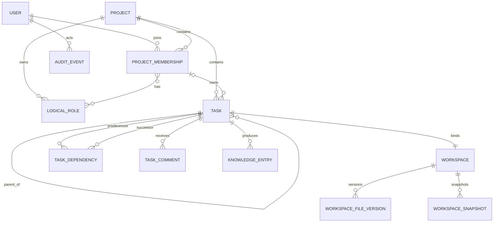
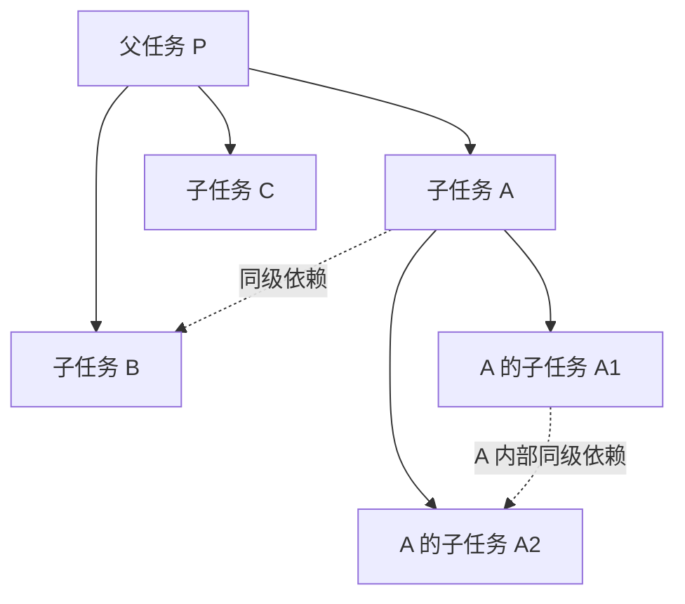
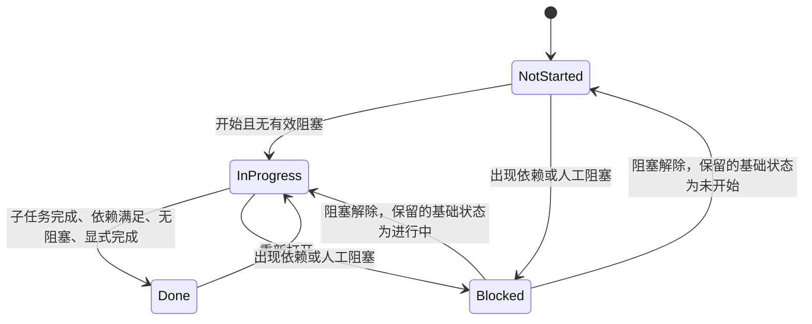

# 领域模型与任务状态机

文档状态：设计基线 0.1  
相关文档：[产品需求](01-product-requirements.md) · [权限模型](03-permission-model.md) · [工作区设计](05-workspace-context-wiki.md)

## 1. 聚合边界

系统以项目为租户边界，但不把整个项目作为一个需要全量锁定的聚合。建议划分为：

- `Project`：项目标识、配置和生命周期。
- `Membership`：加入申请、成员资格、项目权限和成员资料。
- `RoleCatalog`：项目逻辑角色及成员角色绑定。
- `Task`：单任务内容、Owner、状态和父任务引用。
- `SiblingTaskGraph`：同一父任务下直接子任务组成的 DAG。
- `Workspace`：任务工作区、写入租约、文件版本和完成快照。
- `KnowledgeEntry`：摘要、Wiki 投影和搜索索引。
- `AuditEvent`：不可变业务操作记录。

依赖校验围绕 `SiblingTaskGraph` 进行，因此无需锁定整个项目任务图。

## 2. 核心实体关系



## 3. 标识规则

### 3.1 内部标识

所有持久化实体使用 UUID 或等价的不可猜测内部主键。业务编号只用于展示和查询，不参与关联完整性。

### 3.2 Project Key

- 格式：`[A-Z]{2,6}`。
- 全局唯一。
- 创建后不可修改。
- 项目归档或永久删除后默认不释放，避免历史引用指向新项目。

### 3.3 Task Key

- 格式：`{ProjectKey}-{Sequence}`，例如 `ABC-123`。
- `Sequence` 在项目内事务性单调分配。
- 允许出现间隙，不允许复用。
- 移动、归档、重新打开任务均不改变 Task Key。

## 4. 数据对象

### 4.1 Project

| 字段 | 说明 |
|---|---|
| `id` | 内部主键 |
| `key` | 不可变 Project Key |
| `name` | 项目名称 |
| `description` | 项目说明 |
| `owner_user_id` | 唯一 Project Owner |
| `task_sequence` | 下一个任务序号 |
| `agent_guidelines` | 项目级 Agent 规则 |
| `status` | active / archived / deletion_pending |
| `version` | 乐观并发版本 |

### 4.2 LogicalRole

| 字段 | 说明 |
|---|---|
| `id` | 项目角色主键 |
| `project_id` | 所属项目；系统模板使用独立模板表 |
| `source_template_id` | 可选，记录复制来源 |
| `name` | 如“客户端程序员 L2” |
| `level` | 可选的可比较等级，不强制跨角色比较 |
| `capabilities` | 能力范围文本 |
| `responsibilities` | 可独立负责事项 |
| `limitations` | 不适合或不得独立决定事项 |
| `task_hints` | 适合的任务类型与关键词 |
| `agent_prompt` | 面向 Agent 的角色提示文本 |
| `status` | active / archived |

逻辑角色只提供上下文与推荐，不参与授权判断。

### 4.3 ProjectMembership

| 字段 | 说明 |
|---|---|
| `project_id`、`user_id` | 联合唯一成员身份 |
| `permission_level` | owner / admin / member / viewer |
| `introduction` | 项目内自我介绍提示词 |
| `role_ids` | 通过关联表实现多角色绑定 |
| `status` | pending / active / removed |

`admin_mode_enabled` 不应作为永久成员字段保存；它是带过期时间的会话状态。

### 4.4 Task

| 字段 | 说明 |
|---|---|
| `id` | 内部主键 |
| `project_id` | 所属项目 |
| `sequence` | 项目内不可复用序号 |
| `parent_task_id` | 空值表示顶级任务 |
| `owner_membership_id` | 唯一 Task Owner，可暂时为空 |
| `title` | 标题 |
| `goal` | 期望达成的目标 |
| `description` | 工作说明 |
| `acceptance_criteria` | 验收条件 |
| `base_status` | not_started / in_progress / done |
| `due_at` | 截止日期或日期时间 |
| `tags` | 简单标签关联 |
| `created_by` | 审计来源，不构成第二责任人 |
| `version` | 乐观并发版本 |
| `archived_at` | 软删除时间 |

### 4.5 TaskDependency

| 字段 | 说明 |
|---|---|
| `predecessor_task_id` | 必须先完成的任务 |
| `successor_task_id` | 被阻塞的后续任务 |
| `created_by` | 操作者 |
| `created_at` | 创建时间 |

约束：

- 两端不能相同。
- 两端必须属于同一项目。
- 两端的 `parent_task_id` 必须相同，包括同为顶级任务。
- 同一有向边唯一。
- 新增边后不能产生环。

### 4.6 TaskBlocker

人工阻塞单独建模：

| 字段 | 说明 |
|---|---|
| `task_id` | 被阻塞任务 |
| `reason` | 阻塞说明 |
| `created_by` | 创建者 |
| `resolved_at` | 解除时间 |
| `resolved_by` | 解除者 |

未完成前置任务不需要落为 `TaskBlocker`，它可以从依赖实时或缓存计算。

### 4.7 Workspace

Workspace 与 Task 一对一，详细字段见[工作区设计](05-workspace-context-wiki.md)。关键字段包括工作周期、同步版本、写入租约、完成快照和摘要状态。

## 5. 递归任务与局部 DAG

系统的任务结构不是一张任意大图，而是“任务树 + 每个父节点内部的一张子任务 DAG”。



父子实线和依赖虚线属于不同关系。父任务并不是全部子任务的依赖前置；它是组织、上下文和完成聚合边界。

### 5.1 存储建议

MVP 使用邻接表 `parent_task_id` 配合递归查询即可。常用的祖先路径和后代统计可以缓存，但缓存不是权威数据。暂不引入可变 Materialized Path 作为唯一结构来源，避免移动任务时大范围改写。

### 5.2 读取策略

- 查询任务详情时只加载直接子任务和直接依赖。
- 祖先链按需加载，用于面包屑和上下文组合。
- 后代完成统计通过异步投影或递归查询获得。
- 图界面只对当前聚焦父任务的直接子任务执行布局。

## 6. 状态模型

### 6.1 基础状态与有效状态

持久化基础状态：

- `not_started`
- `in_progress`
- `done`

有效状态计算：

```text
if base_status == done:
    effective_status = done
else if exists(active manual blocker)
     or exists(incomplete predecessor):
    effective_status = blocked
else:
    effective_status = base_status
```

这样既能在界面上提供四种状态，也能在依赖完成时自动解除系统阻塞，不会留下失真的人工状态。

### 6.2 状态转换



`Blocked` 是投影状态，不会覆盖此前基础状态。

### 6.3 完成前置条件

任务进入 `done` 必须同时满足：

1. 当前任务有 Task Owner。
2. 全部直接子任务有效状态为 `done`。
3. 全部前置任务有效状态为 `done`。
4. 没有未解决人工阻塞。
5. 操作者拥有完成权限。
6. 若通过 Agent 发起，人工已确认本次完成操作。

子任务全部完成只提供完成资格，不自动改变父任务状态。

### 6.4 重新打开

- 任务从 `done` 重新打开为 `in_progress`。
- 工作区创建新的工作周期并恢复 Owner 写权限。
- 旧完成快照和摘要保持不可变。
- 若父任务已经完成，重新打开子任务前必须先重新打开所有已完成祖先，或使用一个明确展示影响范围的管理员批量操作。

## 7. 结构操作规则

### 7.1 创建子任务

- 已完成父任务必须先重新打开。
- 创建者必须拥有父节点结构操作权。
- 新任务可以暂时未分配，但开始执行前必须设置 Owner。
- 顶级未分配任务只能由管理员模式创建；普通成员创建顶级任务时必须指定 Owner。

### 7.2 移动任务

移动前必须验证：

- 目标父任务不是当前任务或其后代。
- 操作者具有源位置和目标位置的结构权限。
- 当前任务在原同级图中不存在会因移动而非法的依赖。
- 目标父任务未完成。

MVP 不自动迁移或删除依赖；存在相关依赖时拒绝移动，并返回需要先处理的边。

### 7.3 Owner 转移

- 普通成员只能把自己拥有的任务转交给其他活动成员。
- 转移不会同时转移父任务或子任务。
- 有未同步文件或有效写入租约时，转移被阻止。
- 转移完成后，原 Owner 立即失去工作区写权限，新 Owner 获得申请写入租约的资格。
- Agent 发起转移必须人工确认。

### 7.4 归档与删除

默认“删除任务”实现为归档：

- Task Key 不释放。
- 任务、工作区、评论、摘要和审计记录保留。
- 普通成员归档自己的任务前，影响集合中不能包含他人拥有的后代或他人任务的依赖结果。
- 管理员模式可以归档任意任务，但必须预览影响范围。
- 永久删除属于 Project Owner 的回收站操作，不属于普通任务工具。

## 8. 领域事件

建议至少产生以下不可变事件：

- `ProjectCreated`
- `MemberJoined` / `MemberRemoved`
- `LogicalRoleChanged`
- `TaskCreated`
- `TaskContentUpdated`
- `TaskOwnerTransferred`
- `TaskMoved`
- `TaskDependencyAdded` / `TaskDependencyRemoved`
- `TaskBlocked` / `TaskBlockerResolved`
- `TaskStatusChanged`
- `TaskArchived`
- `WorkspaceLeaseAcquired` / `WorkspaceLeaseReleased`
- `WorkspaceVersionSynced`
- `TaskCompleted` / `TaskReopened`
- `SummaryGenerated` / `SummaryConfirmed`
- `AgentOperationProposed` / `AgentOperationConfirmed` / `AgentOperationExecuted`

事件用于审计、通知和投影更新；MVP 不要求完整事件溯源，关系数据库当前状态仍是权威状态。

## 9. 事务与并发

- Task 内容修改检查 `version`，冲突返回当前版本和差异摘要。
- 依赖修改在同一父任务的图事务中执行，并在提交前检测环。
- Owner 转移、写入租约释放和新 Owner 授权必须在同一业务事务中完成。
- 任务完成时锁定当前 Task，重新检查子任务、前置任务和阻塞状态。
- 创建任务使用幂等键，避免 Agent 或网络重试分配多个任务编号。

