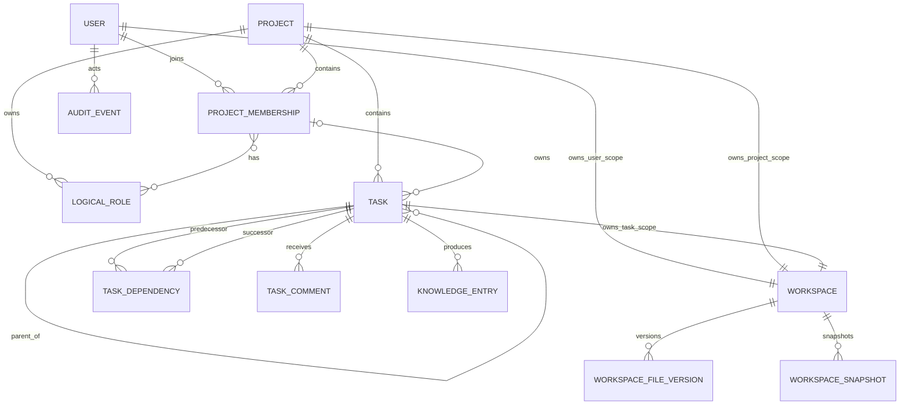
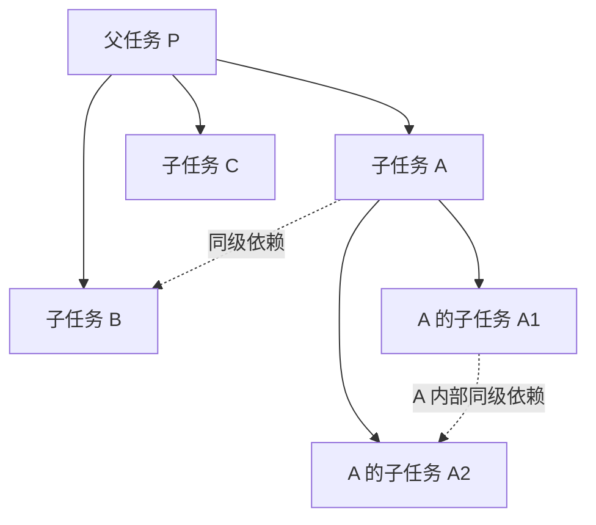
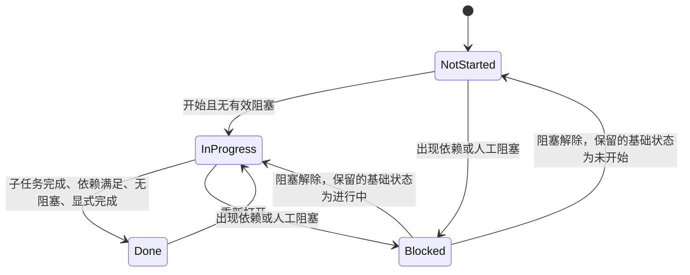

# 领域模型与任务状态机

文档状态：设计基线 0.4

相关文档：[产品需求](01-product-requirements.md) · [权限模型](03-permission-model.md) · [工作区设计](05-workspace-context-wiki.md)

## 1. 聚合边界

系统以项目为租户边界，但不把整个项目作为一个需要全量锁定的聚合。建议划分为：

- `Project`：项目标识、配置和生命周期。
- `Membership`：加入申请、成员资格、项目权限和成员资料。
- `RoleCatalog`：项目逻辑角色及成员角色绑定。
- `Task`：单任务内容、Owner、状态和父任务引用。
- `SiblingTaskGraph`：同一父任务下处于启用态的直接子任务组成的 DAG，并维护独立 `graph_version`。
- `Workspace`：用户级、项目级、任务级工作区，以及各自的写入租约、文件版本和快照。
- `KnowledgeEntry`：摘要、Wiki 投影和搜索索引。
- `AuditEvent`：不可变业务操作记录。

依赖校验围绕 `SiblingTaskGraph` 进行，因此无需锁定整个项目任务图。

## 2. 核心实体关系



## 3. 标识规则

### 3.1 内部标识

所有持久化实体使用 UUID 或等价的不可猜测内部主键。业务编号只用于展示和查询，不参与关联完整性。

### 3.2 Project Key

- 格式：`[A-Z]{2,6}`。
- 全局唯一。
- 创建后不可修改。
- 项目归档或永久删除后默认不释放，避免历史引用指向新项目。

### 3.3 Task Key

- 格式：`{ProjectKey}-{Sequence}`，例如 `ABC-123`。
- `Sequence` 在项目内事务性单调分配。
- 允许出现间隙，不允许复用。
- 移动、归档、重新打开任务均不改变 Task Key。

## 4. 数据对象

### 4.1 Project

| 字段 | 说明 |
|---|---|
| `id` | 内部主键 |
| `key` | 不可变 Project Key |
| `name` | 项目名称 |
| `description` | 项目说明 |
| `owner_user_id` | 唯一 Project Owner |
| `task_sequence` | 下一个任务序号 |
| `status` | active / archived；M7 额外项目删除流程增加 deletion_pending |
| `version` | 乐观并发版本 |

### 4.2 LogicalRole

| 字段 | 说明 |
|---|---|
| `id` | 项目角色主键 |
| `project_id` | 所属项目；系统模板使用独立模板表 |
| `source_template_id` | 可选，记录复制来源 |
| `name` | 如“客户端程序员 L2” |
| `level` | 可选的可比较等级，不强制跨角色比较 |
| `capabilities` | 能力范围文本 |
| `responsibilities` | 可独立负责事项 |
| `limitations` | 不适合或不得独立决定事项 |
| `task_hints` | 适合的任务类型与关键词 |
| `agent_prompt` | 面向 Agent 的角色提示文本 |
| `status` | active / archived |

逻辑角色只提供上下文、任务能力标注与推荐，不参与授权判断。角色归档后，已有 Task 的 `logical_role_id` 历史引用继续保留，但新任务或新修改不能再绑定该角色。

### 4.3 ProjectMembership

| 字段 | 说明 |
|---|---|
| `project_id`、`user_id` | 联合唯一成员身份 |
| `permission_level` | owner / admin / member / viewer |
| `introduction` | 项目内自我介绍提示词 |
| `role_ids` | 通过关联表实现多角色绑定 |
| `status` | pending / active / removed |

`admin_mode_enabled` 不应作为永久成员字段保存；它是带过期时间的会话状态。

### 4.4 Task

| 字段 | 说明 |
|---|---|
| `id` | 内部主键 |
| `project_id` | 所属项目 |
| `sequence` | 项目内不可复用序号 |
| `parent_task_id` | 空值表示虚拟项目根节点下的顶层任务 |
| `owner_membership_id` | 唯一 Task Owner，可暂时为空 |
| `logical_role_id` | 可选，任务所需或推荐的一个项目逻辑角色；不参与授权 |
| `title` | 标题 |
| `content` | 合并目标、工作说明和验收信息的单一富文本或 Markdown 正文 |
| `base_status` | not_started / in_progress / done |
| `due_at` | 可选 UTC 时间点；API 使用带 `Z` 的 RFC 3339，前端按设备系统时区显示 |
| `tags` | 简单标签关联 |
| `display_kind` | normal / sprint / milestone；仅用于外观渲染 |
| `created_by` | 审计来源，不构成第二责任人 |
| `version` | 乐观并发版本 |
| `archived_at` | 仅顶层任务可用；非空表示已归档并退出活动计算 |

本文所称“启用态任务”是一个派生概念：任务记录存在，并且自身及全部祖先的 `archived_at` 均为空。MVP 不提供独立的启用/停用开关。顶层任务归档会使整个子树退出启用态；非顶层任务执行不可恢复删除后不再是启用态，只保留 Task Key 墓碑和不可变审计记录。

`logical_role_id` 表达主要能力要求，不要求 Task Owner 必须绑定该角色；若 Owner 未绑定，界面可以提示但不得据此拒绝指派，也不能由该字段授予权限。

### 4.5 TaskDependency

| 字段 | 说明 |
|---|---|
| `predecessor_task_id` | 必须先完成的任务 |
| `successor_task_id` | 被阻塞的后续任务 |
| `created_by` | 操作者 |
| `created_at` | 创建时间 |

约束：

- 两端不能相同。
- 两端必须属于同一项目。
- 两端的父级作用域必须相同；`parent_task_id` 同为空时，两端都属于虚拟项目根节点，可以互相依赖。
- 同一有向边唯一。
- 只有两个端点都处于启用态时，该边才参与阻塞、完成、拓扑排序和环检测。
- 顶层任务归档后，与其相连的依赖记录继续保留用于历史展示，但不再具有约束力。
- 新增启用边后不能产生环。

每个父级作用域另有一条 `SiblingTaskGraphVersion` 记录：

| 字段 | 说明 |
|---|---|
| `project_id` | 所属项目 |
| `parent_scope_id` | 普通父任务 ID 或虚拟项目根作用域 ID |
| `graph_version` | 依赖边或端点启用状态变化时事务性递增 |

数据库对 `(project_id, parent_scope_id)` 建立唯一约束。依赖提案与确认必须绑定 `graph_version`，不能只绑定端点 Task 版本。

### 4.6 ChangeRequest

跨 Owner 依赖和 Owner 转移使用持久化请求，不能把“等待接受”只保存在通知中。

`TaskDependencyChangeRequest` 至少包含：

| 字段 | 说明 |
|---|---|
| `id` | 请求主键 |
| `action` | add / remove |
| `predecessor_task_id`、`successor_task_id` | 目标依赖两端 |
| `expected_graph_version` | 发起时的父级图版本 |
| `requested_by` | 发起者 |
| `required_acceptor_membership_id` | 另一端点 Owner 或其未分配管理者 |
| `status` | pending / accepted / rejected / expired / stale |
| `expires_at` | 请求过期时间 |

接受时重新检查两端 Owner、父级作用域、启用状态、`graph_version` 和无环约束；任一不一致则标记 `stale`。

`TaskOwnerAssignmentRequest` 至少包含目标 Task、可空原 Owner、目标 Owner、发起时 Task 版本、状态和过期时间，统一覆盖未分配任务指派和 Owner 转移。目标成员接受且 Task 版本、Owner、租约条件仍成立后才执行。创建顶层任务时直接指定另一成员，则先保存不占用 Task Key 的创建请求，目标成员接受后再事务性分配 Task Key、创建 Task 和工作区；普通子任务可以先创建为未分配任务，再建立指派请求。Project Owner 转移使用等价的接受式请求。

### 4.7 TaskBlocker

人工阻塞单独建模：

| 字段 | 说明 |
|---|---|
| `task_id` | 被阻塞任务 |
| `reason` | 阻塞说明 |
| `created_by` | 创建者 |
| `resolved_at` | 解除时间 |
| `resolved_by` | 解除者 |

未完成前置任务不需要落为 `TaskBlocker`，它可以从依赖实时或缓存计算。

### 4.8 Workspace

Workspace 使用统一实体和互斥作用域：

| 字段 | 说明 |
|---|---|
| `id` | Workspace 主键 |
| `scope_type` | user / project / task |
| `scope_id` | 对应 User、Project 或 Task 的内部主键 |
| `sync_version` | 已提交文件清单版本 |
| `workspace_cycle` | 仅任务级使用；用户级和项目级固定为 1 |
| `status` | active / frozen / archived；仅表示服务端生命周期 |
| `created_at` | 创建时间 |

数据库对 `(scope_type, scope_id)` 建立唯一约束，并校验一个 Workspace 只能关联一种作用域：

- 一个 User 对应一个用户级 Workspace，注册时创建。
- 一个 Project 对应一个项目级 Workspace，创建项目时创建。
- 一个 Task 对应一个任务级 Workspace，创建任务时创建。

三种工作区共用文件版本、对象存储、快照和独占写入租约。只有任务级工作区参与任务完成冻结和重新打开周期；用户级与项目级工作区持续演进。服务端生命周期、本地副本同步状态和连接/租约状态分别建模，不能把“已物化”“只读连接”或“可写连接”保存为 Workspace 全局状态。详细规则见[工作区设计](05-workspace-context-wiki.md)。

## 5. 递归任务与局部 DAG

系统的任务结构不是一张任意大图，而是“任务树 + 每个父节点内部的一张启用子任务 DAG”。项目本身提供一个不带 Task Key、不可分配 Owner 的虚拟根节点，所有处于启用态的顶层任务都是它的直接子任务，因此顶层任务也组成一张合法的同级 DAG。归档顶层任务仍保留历史依赖记录，但不属于活动 DAG。



父子实线和依赖虚线属于不同关系。父任务并不是全部子任务的依赖前置；它是组织、上下文和完成聚合边界。

### 5.1 虚拟项目根节点

- 虚拟根节点不是普通 Task，不拥有 Task Key、Owner、工作区、状态或截止日期。
- 顶层任务的 `parent_task_id` 保存为空，但在依赖校验、列表查询和渲染中使用统一的 `project-root:{project_id}` 父级作用域。
- 顶层任务之间可以建立依赖，仍然必须满足同项目、无自环和 DAG 约束。
- 依赖授权中，Project Owner 视为虚拟项目根作用域的控制者；普通父任务则由其 Task Owner 控制共同直接子任务之间的依赖。
- 虚拟项目根和每个普通父任务作用域分别维护 `graph_version`。
- “返回上一级”到达虚拟根节点时，界面显示项目级顶层任务列表。

### 5.2 存储建议

MVP 使用邻接表 `parent_task_id` 配合递归查询即可。常用的祖先路径和后代统计可以缓存，但缓存不是权威数据。暂不引入可变 Materialized Path 作为唯一结构来源，避免移动任务时大范围改写。

### 5.3 读取策略

- 查询任务详情时只加载直接子任务和直接依赖。
- 祖先链按需加载，用于面包屑和上下文组合。
- 后代完成统计通过异步投影或递归查询获得。
- 初版界面只加载当前父级作用域的直接子任务列表和同级依赖；不会递归展开整棵任务树。
- 默认业务视图只返回启用态任务；历史视图可以显式包含已归档顶层任务及其无约束依赖。

## 6. 状态模型

### 6.1 基础状态与有效状态

持久化基础状态：

- `not_started`
- `in_progress`
- `done`

有效状态计算：

```text
if base_status == done:
    effective_status = done
else if exists(active manual blocker)
     or exists(incomplete enabled predecessor):
    effective_status = blocked
else:
    effective_status = base_status
```

这样既能在界面上提供四种状态，也能在依赖完成时自动解除系统阻塞，不会留下失真的人工状态。

### 6.2 状态转换



`Blocked` 是投影状态，不会覆盖此前基础状态。

### 6.3 完成前置条件

任务进入 `done` 必须同时满足：

1. 当前任务有 Task Owner。
2. 全部处于启用态的直接子任务有效状态为 `done`。
3. 全部处于启用态的前置任务有效状态为 `done`。
4. 没有未解决人工阻塞。
5. 操作者拥有完成权限。
6. 若通过 Agent 发起，人工已确认本次完成操作。

启用态直接子任务全部完成只提供完成资格，不自动改变父任务状态。

系统维护可重建的 `completion_ready` 投影。当任务从“不满足完成条件”首次变为“满足全部完成条件”时，产生 `TaskCompletionBecameReady` 事件并向 Task Owner 发送“可完成”提示。同一任务版本或同一完成条件版本只发送一次；任何条件再次失效后重新满足，可以产生新的提示。

### 6.4 展示类型

`display_kind` 只允许 `normal`、`sprint`、`milestone`：

- 它只控制列表图标、色彩、边框或其他视觉样式。
- 它不改变任务是否能包含子任务。
- 它不改变依赖、状态、完成、Owner、权限、工作区或上下文规则。
- Agent 修改展示类型属于任务管理数据修改，必须人工确认。

### 6.5 重新打开

- 任务从 `done` 重新打开为 `in_progress`。
- 任务级工作区创建新的工作周期并恢复 Task Owner 写权限；用户级和项目级工作区不受影响。
- 旧完成快照和摘要保持不可变。
- 若父任务已经完成，重新打开子任务前必须先重新打开所有已完成祖先，或使用一个明确展示影响范围的管理员批量操作。

## 7. 结构操作规则

### 7.1 创建子任务

- 已完成父任务必须先重新打开。
- 创建者必须拥有父节点结构操作权。
- 新任务可以暂时未分配，但开始执行前必须设置 Owner。
- 顶级未分配任务只能由管理员模式创建；普通成员创建顶级任务时可以自我指派，或等待另一成员接受后再正式创建。
- 新任务可以绑定一个可选项目逻辑角色；归档角色不能再用于新绑定。

### 7.2 移动任务

移动前必须验证：

- 目标父任务不是当前任务或其后代。
- 操作者具有源位置和目标位置的结构权限。
- 当前任务在原同级图中不存在会因移动而非法的依赖。
- 目标父任务未完成。

MVP 不自动迁移或删除依赖；存在相关依赖时拒绝移动，并返回需要先处理的边。

### 7.3 Owner 转移

- 普通成员只能把自己拥有的任务转交给其他活动成员。
- 转移先进入待接受状态；目标成员明确接受后才变更 `owner_membership_id`，拒绝或超时则保持原 Owner。
- 转移不会同时转移父任务或子任务。
- 任务级工作区有未同步文件或有效写入租约时，转移被阻止。
- 转移完成后，原 Owner 立即失去任务级工作区写权限，新 Owner 获得申请写入租约的资格；用户级和项目级工作区权限不随任务转移变化。
- Agent 发起转移必须人工确认。

### 7.4 归档与删除

归档与删除按任务层级区分：

- 只有 `parent_task_id` 为空的顶层任务可以归档；归档后整个子树退出默认活动视图和状态计算。
- 归档顶层任务不会删除任务、工作区、评论、摘要、审计或依赖记录；与该子树相连的依赖保留为无约束历史，不再参与阻塞、完成、环检测或排期。
- 归档时递增虚拟根以及子树内所有受端点启用状态影响的父级作用域 `graph_version`，并把归档子树内尚未接受的依赖或 Owner 变更请求标记为 `stale`。
- 任务归档不提供恢复操作。
- 非顶层任务不能归档，只能执行不可恢复删除；删除包含其全部后代，并删除相关活动依赖和工作区业务内容。
- 非顶层任务删除后保留 Task Key 墓碑和不可变审计，Task Key 永不复用，但产品不提供恢复入口。
- 普通成员只能删除自己权限范围内的子树；影响集合包含他人任务时必须进入管理员模式。
- 归档或删除都必须预览后代、Owner、工作区未同步状态和依赖影响。

父任务完成条件只检查仍处于启用态的直接子任务。被删除的子任务不再参与；归档仅适用于顶层任务，因此不会作为普通父任务的直接子任务参与完成计算。

### 7.5 成员移除与项目所有权

- 移除普通成员或 Project Admin 时，其拥有的全部任务在同一事务中将 `owner_membership_id` 置空。
- Owner 置空的任务保留内容、结构、工作区和逻辑角色，但不能进入 `in_progress` 或 `done`，直至重新指派。
- 成员移除会立即撤销其项目级和任务级工作区租约。
- Project Owner 不能直接移除或停用；必须先发起所有权转移，并由目标活动成员接受。
- 项目所有权转移、成员权限更新和项目级工作区租约资格变化必须原子提交，项目始终恰有一个 Project Owner。

## 8. 领域事件

建议至少产生以下不可变事件：

- `ProjectCreated`
- `MemberJoined` / `MemberRemoved`
- `LogicalRoleChanged`
- `TaskCreated`
- `TaskContentUpdated`
- `TaskDisplayKindChanged`
- `TaskOwnerAssigned`
- `TaskOwnerTransferred`
- `TaskMoved`
- `TaskDependencyAdded` / `TaskDependencyRemoved`
- `TaskDependencyChangeRequested` / `TaskDependencyChangeAccepted` / `TaskGraphVersionChanged`
- `TaskBlocked` / `TaskBlockerResolved`
- `TaskStatusChanged`
- `TaskCompletionBecameReady`
- `TaskArchived`
- `TaskDeleted`
- `TaskOwnerCleared`
- `ProjectOwnershipTransferred`
- `WorkspaceLeaseAcquired` / `WorkspaceLeaseReleased`
- `WorkspaceVersionSynced`
- `TaskCompleted` / `TaskReopened`
- `SummaryGenerated` / `SummaryConfirmed`
- `AgentOperationProposed` / `AgentOperationConfirmed` / `AgentOperationExecuted`

事件用于审计、通知和投影更新；MVP 不要求完整事件溯源，关系数据库当前状态仍是权威状态。

## 9. 事务与并发

- Task 内容修改检查 `version`，冲突返回当前版本和差异摘要。
- 依赖修改在同一父任务的图事务中执行，并在提交前检测环。
- 每次活动依赖增删、端点归档、祖先归档导致端点退出启用态或节点删除，都必须锁定全部受影响的父级图版本记录并原子递增各自的 `graph_version`。
- Task Owner 转移、任务级写入租约释放和新 Owner 授权必须在同一业务事务中完成。
- Task Owner 转移只有在目标成员接受后才执行；成员移除导致的 Owner 批量置空与租约撤销必须在同一事务中完成。
- Project Owner/Admin 权限被撤销时，如果其持有项目级工作区租约，授权变化与租约撤销必须原子化。
- 用户被停用时，其用户级工作区租约必须立即撤销并阻止新写入。
- 任务完成时锁定当前 Task，重新检查子任务、前置任务和阻塞状态。
- 创建任务使用幂等键，避免 Agent 或网络重试分配多个任务编号。
