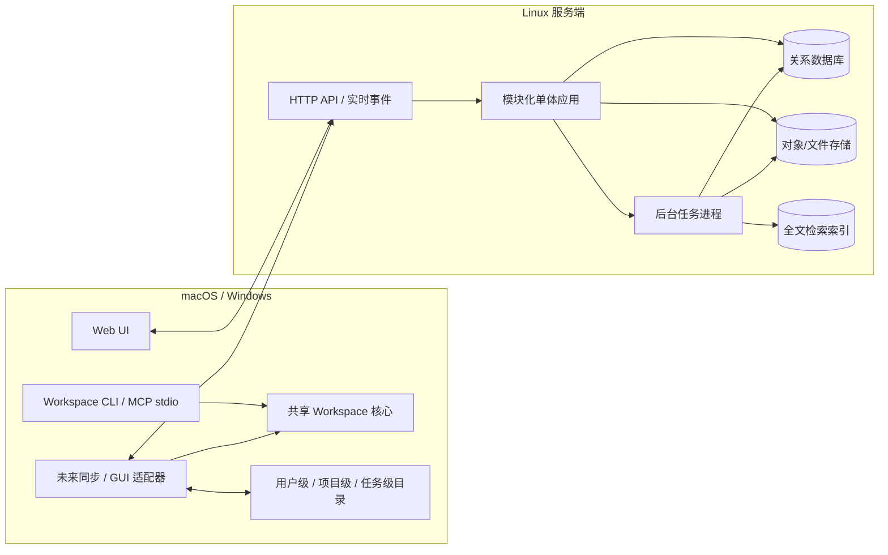
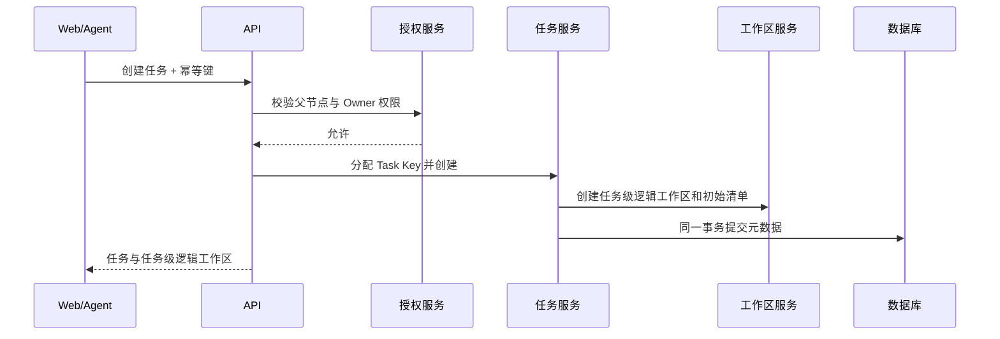
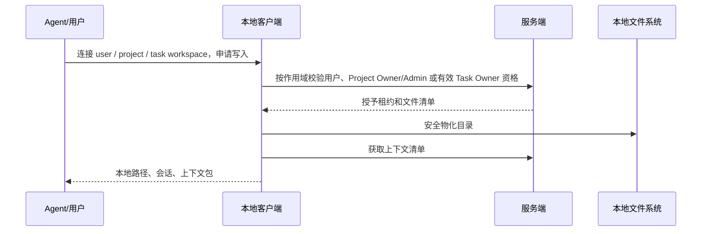

# 系统概要设计

文档状态：设计基线 0.5

相关文档：[产品需求](01-product-requirements.md) · [领域模型](02-domain-model.md) · [工作区设计](05-workspace-context-wiki.md) · [Agent 设计](06-agent-integration.md) · [技术架构决策](09-technical-architecture-decisions.md)

## 1. 架构目标

- Linux 上可自托管的 Web 服务端。
- macOS、Windows 无界面 Workspace CLI；未来同步或 GUI 通过共享核心的平台适配器扩展。
- Web、客户端和 Agent 共用一致的认证、授权与领域规则。
- 初版使用平铺树状界面展示本级任务、当前任务详情、层级面包屑和子任务列表，并能呈现每层最多约 200 节点的局部 DAG；该规模不是硬限制。
- 文本为主、少量图片的用户级、项目级、任务级工作区版本化同步。
- 单个团队少于 20 人时部署和运维足够简单。
- 保持 AI 模型和 Agent 宿主供应商无关。
- 初期按少于 10 名用户、内网或 VPN、单台 Linux Docker 服务器落地，不为高并发或高可用集群提前增加基础设施。
- 服务端不调用外部 API 或 LLM；摘要由用户自己的 Agent 提供，或由服务端用基本任务字段确定性生成。

## 2. 总体架构



当前首版 CLI 只提供离线状态与诊断，不访问文件、数据库或网络；图中的同步、目录访问和 GUI 均是后续经安全设计后接入共享核心的适配能力。

## 3. 为什么采用模块化单体

该项目的复杂度主要来自领域一致性，而不是吞吐量。任务完成、显式 Owner 变化与继承重算、依赖修改、租约和审计需要紧密事务协调。首版拆成微服务会增加分布式事务、部署和调试成本。

模块化单体应保持清晰边界：

- 模块之间通过应用服务或领域事件交互。
- 数据表按模块归属，禁止跨模块随意更新。
- 后台摘要和索引可以作为独立进程扩展，但不拥有业务权威状态。
- 当未来某模块确有独立扩容需求时，再沿现有边界拆分。

## 4. 服务端模块

### 4.1 Identity

- 注册、登录、会话、设备和 API 凭证。
- 用户注册时创建唯一用户级逻辑工作区。
- 密码重置及未来的外部身份提供商扩展。
- Agent 和本地客户端使用短期用户令牌。

### 4.2 Projects & Membership

- Project Key 分配和项目生命周期。
- 加入申请、审批、成员资料和权限角色。
- `Project.owner_membership_id` 是 Project Owner 唯一权威来源；Membership 权限级别只有 admin / member。
- 成员移除时仅清空未完成任务中指向该成员的显式 Owner，并重新计算继承出的有效 Owner；已完成任务保留历史 Owner。
- Project Owner 必须先完成由接收者接受的项目所有权转移。
- 管理员模式短期能力签发。
- 项目创建时创建唯一项目级逻辑工作区；Project Owner/Admin 写入资格随成员权限维护。
- 项目级一致备份、完整性校验和原项目恢复。

### 4.3 Roles

- 系统角色模板；首批模板来自[逻辑角色模板](11-logical-role-templates.json)，包含策划、技术、美术、音乐与声音，技术角色族同时覆盖程序开发与 QA。
- 创建项目时复制快照。
- 项目逻辑角色和成员多角色绑定。

### 4.4 Tasks

- 任务标题、统一正文、父子关系、显式 Owner、继承计算出的有效 Owner、可选逻辑角色、状态、UTC 截止时间、标签和仅影响外观的展示类型。
- 任务编号分配。
- 完成后冻结、按项目策略拒绝或级联重新打开、移动、顶层归档和非顶层不可恢复删除。
- 同项目任务之间的一跳关注关系。
- 子任务统计投影。

### 4.5 Dependency Graph

- 同级边增删、跨 Owner 变更请求与接受。
- 环检测和拓扑排序。
- 每个父级作用域维护事务性 `graph_version`，提案和接受均绑定图版本。
- 已完成端点的依赖冻结；重新打开 predecessor 时按项目设置拒绝或级联重新打开已完成 successor 闭包。
- 普通模式下，拥有两端或共同直接父任务可以直接修改；只拥有一个端点时由另一端点 Owner 接受；顶层任务由 Project Owner 控制虚拟项目根作用域。
- 将顶层任务统一放入虚拟项目根节点作用域，使顶层任务之间可以依赖。
- 前置任务完成投影和有效阻塞状态。
- 为初版本级任务列表提供依赖展示数据；不在服务端保存客户端的临时列表、滚动或选中状态。

### 4.6 Authorization & Audit

- 普通任务范围、管理员模式、工作区单写者和 Agent 确认校验。
- 影响集合计算。
- 不可变审计记录和管理操作查询。

### 4.7 Workspaces

- 用户级、项目级、任务级逻辑工作区创建，并通过 `(scope_type, scope_id)` 保证每个作用域唯一。
- 文件清单、版本、校验和、上传会话和快照。
- 服务端生命周期、本地副本同步状态和连接/租约状态分离。
- `.ngapd/` 控制元数据和 `TASK.md`、`SUMMARY.md` 服务端投影不进入用户内容清单。
- 三种工作区统一使用独占写入租约和多只读连接。
- 用户级写入者为对应用户；项目级写入者为 Project Owner/Admin；任务级写入者为有效 Task Owner。
- 显式/有效 Task Owner 变化和任务完成冻结只作用于任务级工作区；项目成员权限变化实时更新项目级写入资格。
- 租约失效或同步版本冲突时进入显式冲突流程：仍有写资格的用户重新取得租约后选择本地或服务端清单作为新的唯一事实。

### 4.8 Agent Operations

- 工具调用入口。
- 操作提案、确认令牌、幂等和结果记录。
- 分层上下文包清单生成：用户级个人流程/Skill、项目级通用规则/Skill、当前任务信息和任务级过程文件。
- 将当前任务关注的一跳目标加入可发现上下文来源；读取仍受底层权限约束，但不再要求逐个目标确认。
- 允许无确认读取全部授权任务信息；读取其他用户的用户级工作区还必须来自明确用户指令；任何任务管理数据修改必须进入提案确认流程。
- 为当前用户有写资格且持有租约的用户级或任务级工作区提供完整用户内容访问；Agent 写项目级工作区还必须由用户明确请求并确认进入管理员模式；退出可以自动执行。
- 不直接执行绕过 Tasks/Workspaces 的数据库写入。

### 4.9 Knowledge & Notifications

- 接收用户自己的 Agent 随完成提案提交的摘要，或在人工完成缺少摘要时生成确定性基本摘要。
- Wiki 投影和全文检索；服务端不包含模型调用或外部摘要作业。
- Markdown 评论；附件只保存工作区文件引用。
- Owner 变更、评论、阻塞、依赖、本地化截止时间和父任务“可完成”的站内通知。

## 5. 本地 Workspace 核心与未来适配器

当前本地入口是无界面的 `ngapd-workspace` CLI。UI 无关的模型、端口与服务位于 `@ngapd/workspace-core`；CLI 只负责人工诊断、JSON 呈现和 MCP stdio 适配。首版只声明状态与诊断能力，不访问 Workspace 路径，也不包含写能力。

后续同步平台适配器可以在独立需求和安全设计下承担：

- 配置统一的本地 NGAPD 工作区根目录，并映射用户级、项目级和任务级目录。
- 登录并维护设备身份。
- 物化三种作用域的工作区。
- 获取、续租和释放写入租约。
- 监听受管目录变化并计算文件清单/校验和。
- 上传差异并下载服务端版本。
- 向 Workspace 核心提供受限文件、凭证和平台能力。
- 将同步、只读、租约占用、冻结和权限失效状态投影给 Agent 或可选 GUI。
- 租约失效或服务端版本不匹配时停止上传并展示差异；仍有写资格的用户重新取得租约后，选择本地或服务端版本成为新的唯一事实。

任何本地适配器都不是业务权威源。任务状态、Owner、依赖、项目成员权限和三种工作区的已同步版本均以服务端为准。未来 GUI 必须调用共享核心或正式结构化协议，不得解析 CLI 人类文本。

## 6. Agent 工具服务

Agent 工具服务当前由 `ngapd-workspace serve --stdio` 作为独立进程提供，并通过正式 MCP transport 与宿主通信。首版只暴露 `workspace_status` 和 `workspace_doctor` 两个只读工具；下列业务能力属于后续版本，必须在相应服务端、权限、路径和同步前置条件完成后才可注册：

- 将用户、Project Key 或 Task Key 解析为对应服务端工作区和本地目录。
- 建立连接会话并获取上下文清单。
- 将文件访问限制在解析后的真实工作区路径内。
- 向 Agent 暴露结构化任务工具。
- 对需要确认的调用返回操作提案，而不是直接修改。
- 将确认后的提案提交到服务端执行。

stdio 以外的本地 IPC、OS 用户隔离、宿主配对、短期本地能力和令牌安全存储在详细设计阶段确定，并必须在 M5 开始前形成安全设计；在此之前 CLI 不监听 TCP、Unix socket 或 Named Pipe，也不接受未登记路径。

详细工具见[Agent 接口与 Skill 设计](06-agent-integration.md)。

## 7. 数据存储

### 7.1 关系数据库

保存：

- 用户、项目、成员和逻辑角色。
- 任务、显式 Owner、父子关系、依赖、关注、父级图版本、依赖变更请求、阻塞和状态。
- 三种作用域的工作区元数据、文件清单、租约和快照元数据。
- 评论、通知、摘要元数据、项目备份清单、Agent 提案和审计。

递归任务使用邻接表。依赖环检测在应用事务内执行；每个父级图版本记录作为并发串行化边界，并结合数据库唯一约束和行锁保证一致性。

### 7.2 对象存储

保存工作区文件内容和不可变快照。对象键由服务端内部 ID 和内容哈希生成，不直接拼接用户文件名。开发环境可以使用兼容实现或受管本地存储，生产环境接口保持对象存储语义。

### 7.3 全文检索

首版使用 PostgreSQL 自带全文检索和 `pg_trgm`；只有在文档量和搜索要求增长后再引入独立搜索服务。索引是可重建投影，不作为摘要或文件的权威来源。

## 8. API 风格

### 8.1 基本约定

- 使用版本化 HTTP/JSON API。
- 资源更新携带 `version` 或条件请求头。
- 创建、Agent 确认执行、上传完成等接口支持幂等键。
- 错误返回稳定机器码、用户可读说明和修复建议。
- 长耗时摘要、索引和大文件处理返回作业 ID。

### 8.2 代表性资源

```text
/projects
/projects/{projectKey}/members
/projects/{projectKey}/roles
/users/{userId}/workspace
/projects/{projectKey}/workspace
/projects/{projectKey}/tasks
/tasks/{taskKey}
/tasks/{taskKey}/children
/tasks/{taskKey}/dependencies
/tasks/{taskKey}/dependency-requests
/tasks/{taskKey}/follows
/tasks/{taskKey}/workspace
/workspaces/{workspaceId}/lease
/workspaces/{workspaceId}/files
/tasks/{taskKey}/comments
/tasks/{taskKey}/knowledge
/agent/sessions
/agent/operations
/agent/admin-mode
/admin-mode/sessions
/projects/{projectKey}/backups
/projects/{projectKey}/restore
```

### 8.3 实时事件

Web UI 和本地客户端需要接收任务、租约、同步和通知变化。可使用 WebSocket 或服务端事件流；实时通道只负责提示客户端重新获取权威资源，不承担业务提交。

## 9. 关键流程

### 9.1 创建任务



顶层任务创建时必须指定活动显式 Owner；子任务可以指定任意活动成员，也可以把显式 Owner 留空并继承最近祖先。任务和任务级逻辑工作区在同一事务中立即创建，Task Owner 指派不等待目标成员接受。

### 9.2 连接任一类型工作区



### 9.3 Agent 修改任务管理数据


## 10. 初版任务界面架构

初版不实现语义缩放、嵌套画布或节点内子图，而是围绕一个明确的“当前父级作用域”渲染平铺树状页面：

- 项目根页面把虚拟项目根节点作为当前父级，显示全部顶层任务及其同级依赖。
- 进入某个任务后，页面显示层级面包屑、返回上一级按钮和当前任务详情。
- 当前任务的直接子任务显示为独立列表，列表中呈现同级依赖、状态、有效 Owner 及继承标记、逻辑角色、按本地时区显示的截止时间和子任务统计。
- 选择子任务会切换当前父级作用域，不在同一画布递归展开全部后代。
- 普通、冲刺、里程碑使用不同外观组件或样式变量，但复用同一数据和交互逻辑。
- 搜索 Task Key 或标题后，服务端返回祖先链，客户端据此恢复面包屑并定位任务。
- 列表使用分页或虚拟化；同层超过 200 个任务时仍允许访问，建议结合筛选与搜索。
- 同级依赖布局只计算当前层，不需要进行递归坐标转换。

语义缩放、节点内嵌子图和无限画布作为后续独立里程碑，不进入初版前端架构的完成条件。

## 11. 同步与一致性边界

- 任务元数据：服务端强一致事务。
- 同级依赖图：单父节点范围内事务一致，并由 `graph_version` 标识。
- 任务移动：按稳定顺序锁定源、目标两个父级图版本，在锁内复查依赖和层级约束并同时递增两边 `graph_version`。
- 三种工作区文件：分别在各自独占写入租约下进行版本递增同步；冲突选择通过比较交换创建新的唯一版本。
- Wiki 和搜索：最终一致，可由事件重建。
- 通知：至少一次投递，客户端按通知 ID 去重。
- Agent 任务修改：所有提案与确认绑定目标 Task 版本、相关 `graph_version` 和影响集合指纹；任一变化后确认失效。关注目标的读取不另行确认但不扩大底层权限。用户级和任务级文件操作由租约和同步版本约束；项目级文件操作额外要求显式管理员模式。

## 12. 安全设计

- 所有服务端查询带项目租户过滤，不能仅依赖客户端传入 Project Key。
- 本地路径使用规范化真实路径校验，拒绝 `..`、符号链接逃逸和工作区根目录外访问。
- `.ngapd/`、`TASK.md` 和 `SUMMARY.md` 由系统控制，Agent 文件接口一律拒绝写入。
- 上传使用服务端签发的短期目标，不允许任意对象键。
- 文件内容、评论和角色提示文本加载给 Agent 时标记来源和信任等级。
- 管理员能力、工作区租约和 Agent 确认令牌均短期有效、目标绑定、不可转用；Agent 进入管理员模式只能由用户显式确认，退出时可主动销毁管理员能力。
- 审计日志避免保存不必要的工作区全文和敏感令牌。

## 13. 部署拓扑

MVP 使用单台 Linux 主机上的 Docker Compose，具体技术选择见[技术架构决策](09-technical-architecture-decisions.md)。最小自托管部署包含：

- Web/API 应用进程。
- 后台任务进程。
- 关系数据库。
- 对象存储或兼容文件存储。
- 反向代理与 TLS。

初期少于 10 名用户，通过内网或 VPN 访问，不要求高可用、集群、Kubernetes、Redis、独立搜索服务或独立对象存储服务。应用、后台进程、PostgreSQL 和内容寻址文件存储位于同一 Linux 主机的独立容器/持久卷中。客户端安装包分别面向 macOS 和 Windows。MVP 必须能为单个项目创建数据库与对象内容一致的备份，并恢复到原项目。

## 14. 项目级备份与恢复

- Project Owner 可以创建项目级备份；系统在一个一致检查点上固定项目业务记录、全部项目/任务工作区清单、对象引用、完成快照、知识条目和必要审计引用。
- 备份必须包含或可独立取得清单引用的全部对象内容，并保存清单哈希；仅复制数据库或仅复制对象目录都不算成功备份。
- 恢复只允许回到原项目，执行前校验备份清单、对象完整性和当前影响范围，并由 Project Owner 明确确认。
- 恢复在项目级排他窗口内撤销活动租约与未执行提案，并递增 `recovery_epoch`；Project ID、Project Key、当前 Project Owner、备份目录和恢复审计不回滚。
- 恢复演练必须验证任务、依赖、关注、文件清单、对象内容、完成快照和摘要来源一致。
- 本地未同步文件不属于项目备份，客户端必须清晰展示该风险。
- 产品不提供项目永久删除、任务回收站或从项目备份中选择单个任务恢复。非顶层任务删除仍不可恢复，并要求输入完整 Task Key；日常整理优先使用已完成顶层任务归档。
