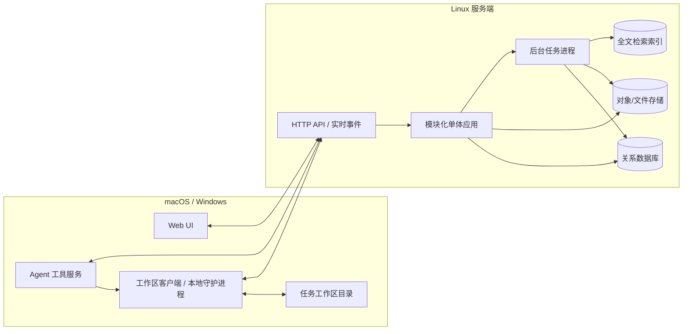
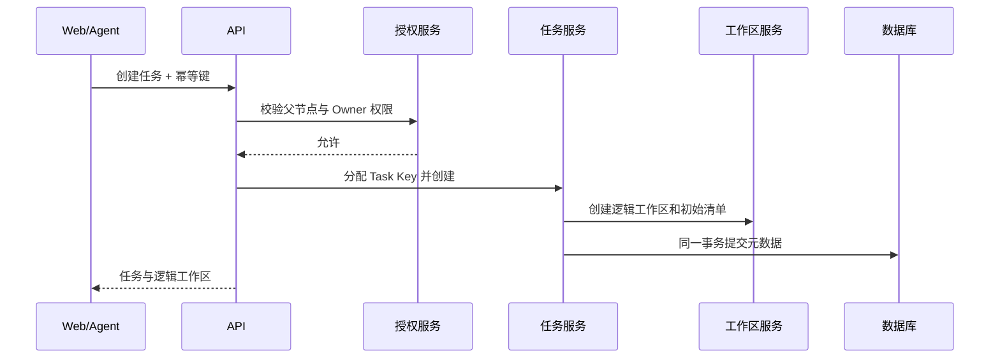
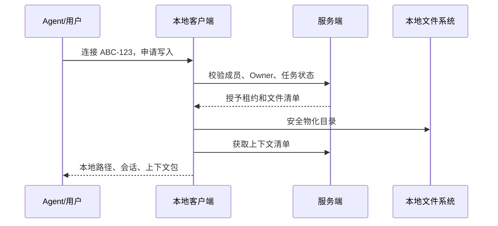
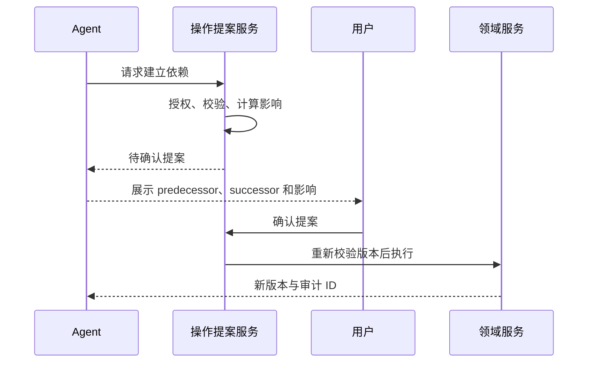

# 系统概要设计

文档状态：设计基线 0.1  
相关文档：[产品需求](01-product-requirements.md) · [领域模型](02-domain-model.md) · [工作区设计](05-workspace-context-wiki.md) · [Agent 设计](06-agent-integration.md)

## 1. 架构目标

- Linux 上可自托管的 Web 服务端。
- macOS、Windows 本地工作区客户端。
- Web、客户端和 Agent 共用一致的认证、授权与领域规则。
- 支持任务树和每层最多约 200 节点的局部 DAG 可视化，同时不把该规模做成硬限制。
- 文本为主、少量图片的任务工作区版本化同步。
- 单个团队少于 20 人时部署和运维足够简单。
- 保持 AI 模型和 Agent 宿主供应商无关。

## 2. 总体架构



## 3. 为什么采用模块化单体

该项目的复杂度主要来自领域一致性，而不是吞吐量。任务完成、Owner 转移、依赖修改、租约和审计需要紧密事务协调。首版拆成微服务会增加分布式事务、部署和调试成本。

模块化单体应保持清晰边界：

- 模块之间通过应用服务或领域事件交互。
- 数据表按模块归属，禁止跨模块随意更新。
- 后台摘要和索引可以作为独立进程扩展，但不拥有业务权威状态。
- 当未来某模块确有独立扩容需求时，再沿现有边界拆分。

## 4. 服务端模块

### 4.1 Identity

- 注册、登录、会话、设备和 API 凭证。
- 密码重置及未来的外部身份提供商扩展。
- Agent 和本地客户端使用短期用户令牌。

### 4.2 Projects & Membership

- Project Key 分配和项目生命周期。
- 加入申请、审批、成员资料和权限角色。
- 管理员模式短期能力签发。

### 4.3 Roles

- 系统角色模板。
- 创建项目时复制快照。
- 项目逻辑角色和成员多角色绑定。

### 4.4 Tasks

- 任务内容、父子关系、Owner、状态、截止日期和标签。
- 任务编号分配。
- 完成、重新打开、移动和归档。
- 子任务统计投影。

### 4.5 Dependency Graph

- 同级边增删。
- 环检测和拓扑排序。
- 前置任务完成投影和有效阻塞状态。
- 图布局输入数据，不在服务端保存某个客户端的临时缩放状态。

### 4.6 Authorization & Audit

- 普通任务范围、管理员模式、工作区单写者和 Agent 确认校验。
- 影响集合计算。
- 不可变审计记录和管理操作查询。

### 4.7 Workspaces

- 逻辑工作区创建。
- 文件清单、版本、校验和、上传会话和快照。
- 独占写入租约。
- Owner 转移和完成冻结。

### 4.8 Agent Operations

- 工具调用入口。
- 操作提案、确认令牌、幂等和结果记录。
- 上下文包清单生成。
- 不直接执行绕过 Tasks/Workspaces 的数据库写入。

### 4.9 Knowledge & Notifications

- 完成摘要任务、Wiki 投影和全文检索。
- 评论。
- Owner 变更、评论、阻塞、依赖和截止日期通知。

## 5. 本地客户端

本地客户端建议由一个后台进程和一个轻量管理界面组成。职责包括：

- 配置每个项目的本地工作区根目录。
- 登录并维护设备身份。
- 物化任务工作区。
- 获取、续租和释放写入租约。
- 监听受管目录变化并计算文件清单/校验和。
- 上传差异并下载服务端版本。
- 向本地 Agent 工具服务提供受限文件访问。
- 显示同步、只读、租约占用、冻结和权限失效状态。

本地客户端不是项目业务权威源。任务状态、Owner、依赖和工作区已同步版本以服务端为准。

## 6. Agent 工具服务

Agent 工具服务可以嵌入本地客户端，也可以作为调用本地客户端 API 的独立进程。它负责：

- 将 `ABC-123` 解析为服务端任务和本地目录。
- 建立连接会话并获取上下文清单。
- 将文件访问限制在解析后的真实工作区路径内。
- 向 Agent 暴露结构化任务工具。
- 对需要确认的调用返回操作提案，而不是直接修改。
- 将确认后的提案提交到服务端执行。

详细工具见[Agent 接口与 Skill 设计](06-agent-integration.md)。

## 7. 数据存储

### 7.1 关系数据库

保存：

- 用户、项目、成员和逻辑角色。
- 任务、父子关系、依赖、阻塞和状态。
- 工作区元数据、文件清单、租约和快照元数据。
- 评论、通知、摘要元数据、Agent 提案和审计。

递归任务使用邻接表。依赖环检测在应用事务内执行，并可结合数据库唯一约束和行锁保证一致性。

### 7.2 对象存储

保存工作区文件内容和不可变快照。对象键由服务端内部 ID 和内容哈希生成，不直接拼接用户文件名。开发环境可以使用兼容实现或受管本地存储，生产环境接口保持对象存储语义。

### 7.3 全文检索

首版可以使用关系数据库自带全文检索能力；只有在文档量和搜索要求增长后再引入独立搜索服务。索引是可重建投影，不作为摘要或文件的权威来源。

## 8. API 风格

### 8.1 基本约定

- 使用版本化 HTTP/JSON API。
- 资源更新携带 `version` 或条件请求头。
- 创建、Agent 确认执行、上传完成等接口支持幂等键。
- 错误返回稳定机器码、用户可读说明和修复建议。
- 长耗时摘要、索引和大文件处理返回作业 ID。

### 8.2 代表性资源

```text
/projects
/projects/{projectKey}/members
/projects/{projectKey}/roles
/projects/{projectKey}/tasks
/tasks/{taskKey}
/tasks/{taskKey}/children
/tasks/{taskKey}/dependencies
/tasks/{taskKey}/workspace
/tasks/{taskKey}/comments
/tasks/{taskKey}/knowledge
/agent/sessions
/agent/operations
/admin-mode/sessions
```

### 8.3 实时事件

Web UI 和本地客户端需要接收任务、租约、同步和通知变化。可使用 WebSocket 或服务端事件流；实时通道只负责提示客户端重新获取权威资源，不承担业务提交。

## 9. 关键流程

### 9.1 创建任务



### 9.2 连接工作区



### 9.3 Agent 结构修改



## 10. 图形界面架构

任务图应按当前聚焦父任务局部渲染，而不是一次把整个递归树展开到同一画布：

- 每个父任务的直接子任务构成独立布局单元。
- 展开节点时再请求该节点的子图。
- 布局在 Web Worker 或等价后台线程执行。
- 屏幕外节点和折叠子图使用虚拟化。
- 节点尺寸随语义档位离散变化，布局结果可按图版本缓存。
- 依赖边只在同一布局单元内路由，父子容器负责坐标转换。
- 同层超过 200 节点仍允许操作，但可提示用户使用过滤、搜索或分组聚焦。

首版优先保证选择、定位、编辑和正确性，再优化连续动画。

## 11. 同步与一致性边界

- 任务元数据：服务端强一致事务。
- 同级依赖图：单父节点范围内事务一致。
- 工作区文件：写入租约下的版本递增同步。
- Wiki 和搜索：最终一致，可由事件重建。
- 通知：至少一次投递，客户端按通知 ID 去重。
- Agent 操作：提案与确认绑定目标版本；版本变化后确认失效。

## 12. 安全设计

- 所有服务端查询带项目租户过滤，不能仅依赖客户端传入 Project Key。
- 本地路径使用规范化真实路径校验，拒绝 `..`、符号链接逃逸和工作区根目录外访问。
- 上传使用服务端签发的短期目标，不允许任意对象键。
- 文件内容、评论和角色提示文本加载给 Agent 时标记来源和信任等级。
- 管理员能力、工作区租约和 Agent 确认令牌均短期有效、目标绑定、不可转用。
- 审计日志避免保存不必要的工作区全文和敏感令牌。

## 13. 部署拓扑

最小自托管部署包含：

- Web/API 应用进程。
- 后台任务进程。
- 关系数据库。
- 对象存储或兼容文件存储。
- 反向代理与 TLS。

小团队部署可将应用和后台进程放在同一 Linux 主机，但数据库与对象文件应有独立备份。客户端安装包分别面向 macOS 和 Windows。

## 14. 备份与恢复

- 数据库和对象存储必须使用同一恢复点策略。
- 工作区快照按内容哈希去重，但引用关系要进入备份。
- 恢复演练必须验证任务、文件清单、对象内容和摘要来源一致。
- 永久删除采用延迟清理；在保留期内对象仍可从回收站恢复。
- 本地未同步文件不属于服务端备份，客户端必须清晰展示该风险。

