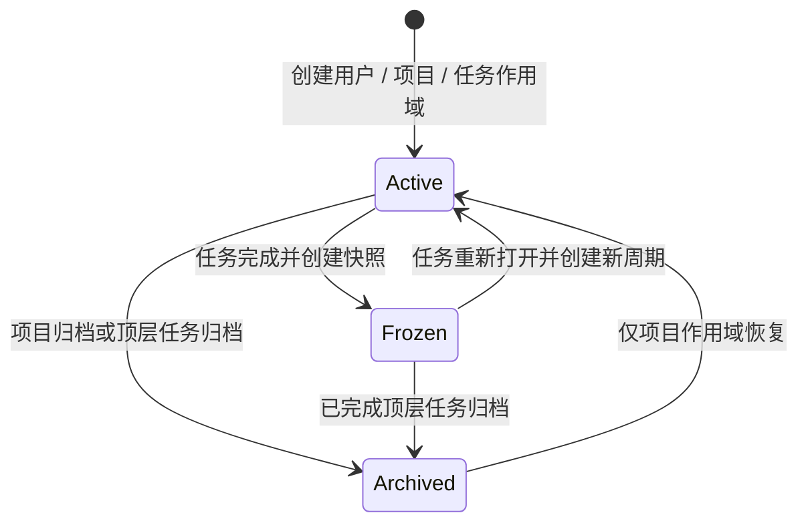

# 工作区、上下文与 Wiki 设计

文档状态：设计基线 0.5

相关文档：[权限模型](03-permission-model.md) · [系统架构](04-system-architecture.md) · [Agent 设计](06-agent-integration.md)

## 1. 设计目标

系统提供三种工作区作用域：

| 类型 | 数量 | 主要内容 | 写入者 |
|---|---|---|---|
| 用户级 | 每个用户一个 | 个人工作流程、个人规则、自用 Skill、个人参考资料 | 对应用户 |
| 项目级 | 每个项目一个 | 项目通用规则、通用 Skill、团队约定、共享参考资料 | Project Owner、Project Admin |
| 任务级 | 每个任务一个 | 分析、决策、过程文档、任务参考资料和交付物 | 有效 Task Owner |

三种工作区共同承担以下职责：

1. 将个人偏好、团队通用知识和任务过程分层保存，避免上下文污染。
2. 为 Agent 提供来源清晰、可选择、可追溯的规则、Skill 和资料。
3. 使用统一的文件同步、版本、审计和独占写入租约。
4. 让任务级成果形成项目 Wiki，同时保留项目通用规范和个人工作方式。

工作区不是源代码仓库，也不是无边界网盘。其首要内容是文本、规则、Skill 和过程资料，辅以少量图片和必要产物。

上表描述人的基础写入者资格。代表 Project Owner/Admin 的 Agent 写入项目级工作区时，还必须由用户明确要求并确认进入管理员模式；用户级和当前用户拥有的任务级工作区不增加该条件。

## 2. 逻辑工作区与本地工作区

### 2.1 逻辑工作区

服务端根据作用域创建唯一逻辑工作区：

- 用户注册时创建用户级工作区，并与 User ID 绑定。
- 项目创建时创建项目级工作区，并与 Project ID 绑定。
- 任务创建时创建任务级工作区，并与 Task ID 绑定。

每个逻辑工作区都包含 Workspace ID、`scope_type`、`scope_id`、服务端生命周期、同步版本、文件版本和租约记录。任务级工作区额外包含工作周期、任务机器快照引用、完成快照和摘要来源。摘要来源区分用户自己的 Agent 提交、用户人工填写和服务端确定性基本摘要；服务端不调用外部模型。`.ngapd/` 下的机器文件属于客户端控制面，不进入服务端内容清单。

服务端无法直接在成员电脑上创建目录，因此创建作用域时先建立逻辑工作区，在第一次读取或写入连接时物化本地目录。

### 2.2 本地工作区

每台设备配置一个 NGAPD 本地根目录，例如：

```text
NGAPD-Workspaces/
  users/
    user-id/
      _user/
  projects/
    ABC/
      _project/
      tasks/
        ABC-123/
        ABC-124/
```

用户目录使用稳定内部用户标识；项目目录使用 Project Key；任务目录按稳定 Task Key 平铺，不随任务树层级改变。任务移动时目录路径保持不变，避免破坏引用、脚本和 Agent 会话。

## 3. 推荐目录结构

用户级工作区：

```text
_user/
  .ngapd/
    scope.json
    workspace.json
    manifest.json
  USER.md
  rules/
  workflows/
  skills/
  references/
```

项目级工作区：

```text
_project/
  .ngapd/
    scope.json
    workspace.json
    manifest.json
  PROJECT.md
  rules/
  skills/
  references/
```

任务级工作区：

```text
ABC-123/
  .ngapd/
    scope.json
    task.json
    workspace.json
    manifest.json
  TASK.md
  notes/
  decisions/
  references/
  artifacts/
  SUMMARY.md
```

### 3.1 控制文件、投影文件与同步内容

| 路径 | 所有者 | 是否进入内容同步 | 用途 |
|---|---|---|---|
| `.ngapd/scope.json` | 系统 | 否 | 工作区类型、作用域 ID 和读取/写入策略快照 |
| `.ngapd/task.json` | 系统，仅任务级 | 否 | 机器可读任务快照，由服务端数据再生成 |
| `.ngapd/workspace.json` | 本地客户端 | 否 | Workspace ID、工作周期（如有）、同步版本和本设备信息 |
| `.ngapd/manifest.json` | 本地客户端 | 否 | 服务端用户内容清单的本地缓存；不包含自身或其他 `.ngapd/` 文件 |
| `USER.md` | 系统/用户 | 是 | 用户级工作区说明和个人入口索引 |
| `PROJECT.md` | 系统/项目管理员 | 是 | 项目级工作区说明和团队入口索引 |
| `TASK.md` | 系统，仅任务级 | 否，服务端投影 | Agent/人可读任务说明，由服务端任务数据再生成 |
| `SUMMARY.md` | 系统，仅任务级 | 否，服务端投影 | 当前工作周期 KnowledgeEntry 摘要的只读投影 |

`.ngapd/`、`TASK.md` 和 `SUMMARY.md` 不参与用户内容的 `sync_version`，客户端可以从服务端权威数据重新生成。Agent 和普通文件写入接口不得写入 `.ngapd/`、`TASK.md` 或 `SUMMARY.md`。Owner 修订摘要时调用摘要接口，服务端更新 KnowledgeEntry 后再刷新 `SUMMARY.md` 投影。

### 3.2 用户内容目录

- `rules/`：用户个人规则或项目通用规则。
- `workflows/`：用户个人工作流程；项目级默认不需要，但允许自定义增加。
- `skills/`：用户自用 Skill 或项目通用 Skill。
- `notes/`：任务分析、调研、方案草稿、会议和实验记录。
- `decisions/`：任务已经作出的关键决定，建议一项决定一个文件。
- `references/`：对应作用域的文本、少量图片副本或链接说明。
- `artifacts/`：任务报告、导出物、可交付说明等。

目录不是强制分类器。合格写入者可以增加自定义文件和子目录，但不能修改控制文件和服务端投影文件。

## 4. 任务机器快照

`.ngapd/task.json` 的概念结构如下：

```json
{
  "schemaVersion": 1,
  "taskKey": "ABC-123",
  "taskVersion": 17,
  "title": "实现角色冲刺",
  "content": "玩家可以在规定条件下进入冲刺状态。需要支持键盘与手柄；耐力不足时不能开始冲刺。",
  "explicitOwner": null,
  "effectiveOwner": {
    "memberId": "member-id",
    "displayName": "示例成员"
  },
  "ownerInheritedFrom": "ABC-100",
  "logicalRole": {
    "roleId": "role-id",
    "name": "玩法程序员 L2"
  },
  "effectiveStatus": "in_progress",
  "dueAt": "2026-08-01T09:00:00Z",
  "displayKind": "sprint",
  "parent": "ABC-100",
  "predecessors": ["ABC-121"],
  "workspaceCycle": 1
}
```

文件只是服务端数据的本地镜像。`explicitOwner` 是 Task 自身字段，`effectiveOwner` 和 `ownerInheritedFrom` 是服务端按祖先链计算的投影；任务完成时会把有效 Owner 固化为显式 Owner。修改或删除该文件不能绕过 API 改变任务正文、Task Owner、状态、展示类型或依赖；客户端可以从服务端重新生成它，并提示本地副本与权威数据的差异。

`TASK.md` 使用相同数据生成，面向阅读而不是机器回写。用户过程记录放在其他文件，避免系统更新覆盖人工内容。

## 5. 工作区生命周期

工作区相关状态分为三组，分别持久化，不能合并为一个互斥状态机。

### 5.1 服务端工作区生命周期



- `active`：服务端允许按权限建立读写连接。
- `frozen`：仅任务级使用；当前工作周期已完成，用户内容和完成快照不可变。
- `archived`：项目或顶层任务退出活动范围，只读保留；任务不提供恢复操作。顶层任务归档时，其子树工作区一并进入只读历史范围。

项目恢复时，项目级工作区从 `archived` 返回 `active`；其任务仍保持归档前各自的生命周期。任务归档不提供反向转换。非顶层任务不可恢复删除后，其工作区退出产品读取面；失去全部有效引用的对象由常规垃圾回收清理，不提供保留期或恢复入口。

用户级和项目级工作区不会因为某个任务完成而进入 `Frozen`，其内容可以持续演进。

### 5.2 本地副本状态

每台设备为每个已物化工作区独立保存：

- `not_materialized`
- `materializing`
- `up_to_date`
- `local_changes_with_valid_lease`
- `stale_or_lease_invalid`
- `replacing_from_server`
- `error`

同一个服务端 Workspace 可以同时在多台设备存在不同的本地副本状态。

### 5.3 连接与租约状态

每个客户端或 Agent 会话独立处于 `disconnected`、`read_only` 或 `write_lease_active`。一个 Workspace 可以同时有多个 `read_only` 会话，但最多一个 `write_lease_active` 会话。物化状态、只读连接和可写连接都不是 Workspace 全局生命周期。

## 6. 单写入租约

### 6.1 必要性

用户级和任务级虽然各自只有一个主要写入者，仍可能从多设备并发写入；项目级则可能由 Project Owner 与多名 Project Admin 同时具备写资格。因此三种工作区都必须通过唯一活动写入租约确保同一时刻只有一个可写连接。

### 6.2 租约字段

- `lease_id`
- `workspace_id`
- `workspace_cycle`
- `holder_user_id`
- `device_id`
- `client_session_id`
- `issued_at`
- `expires_at`
- `last_renewed_at`
- `base_sync_version`

### 6.3 租约规则

- 申请者必须符合工作区作用域写入策略：用户本人、Project Owner/Admin 或 Task Owner。
- 一个 Workspace/周期最多一个未过期租约。
- 客户端心跳续租，短暂断网提供有限宽限期。
- 租约过期后，本地目录切换为逻辑只读，停止自动上传。
- 任一第二连接默认只读，即使它来自同一用户或另一名 Project Admin。
- 接管操作先尝试通知原设备同步释放；强制接管需人工确认。
- 服务端拒绝过期租约提交，即使提交者仍符合写入者资格。
- 用户被停用、Project Owner/Admin 资格被撤销、有效 Task Owner 改变或作用域归档时，相关租约立即失效。
- 租约一旦失效或基础版本不匹配，客户端停止自动上传并进入冲突状态，不静默覆盖本地或服务端内容。
- 若当前用户仍具有写资格，可以重新取得唯一租约并明确选择本地或服务端版本作为新的唯一事实；选择本地会提交完整本地清单为新版本，选择服务端会覆盖本地受管文件。
- 若旧持有者已经失去写资格，其本地变化保留为未受管冲突副本，不能提交为服务端事实。

## 7. 同步协议

### 7.1 权威版本

服务端维护递增的 `sync_version` 和该版本的用户内容文件清单。文件内容以哈希寻址，路径只是清单属性。`.ngapd/`、`TASK.md` 和 `SUMMARY.md` 不进入该清单。

### 7.2 初次物化

1. 客户端规范化并验证 NGAPD 工作区根目录。
2. 获取用户、项目或任务作用域信息，以及工作区状态和目标权限。
3. 只读连接直接拉取最新清单；写连接先获取租约。
4. 下载缺失的内容哈希。
5. 使用临时文件写入并原子替换目标文件；若检测到本地副本来自失效租约或旧版本且包含改动，先进入冲突状态，不自动覆盖任一侧。
6. 在内容物化完成后重新生成本地 manifest、scope 快照，以及任务级工作区的 task/summary 投影。

### 7.3 写入者同步

1. 文件监听器发现变化并做防抖。
2. 客户端计算新清单和内容哈希。
3. 忽略 `.ngapd/`、`TASK.md`、`SUMMARY.md`、临时文件、系统缓存和项目配置的排除规则。
4. 上传服务端缺失的内容对象。
5. 以 `lease_id + base_sync_version` 提交新清单。
6. 服务端验证租约、作用域写入资格、周期和基础版本。
7. 原子创建新版本，发布 `WorkspaceVersionSynced`。

由于存在独占租约，正常情况下不会出现两个合法写入者。版本不匹配意味着当前提交没有资格直接覆盖服务端；服务端拒绝提交并返回服务端清单摘要，客户端进入冲突处理。

仍有写资格的用户可以重新获取唯一租约后选择：

- `use_local`：展示完整差异并确认后，以当前服务端 `sync_version` 为比较交换基础，把完整本地清单提交为一个新版本。
- `use_remote`：展示将被覆盖的本地路径并确认后，用服务端清单替换本地受管文件。

两种选择都不做自动逐文件合并，选择结果成为新的唯一事实，并记录操作者、两侧版本、差异摘要和结果。

当前用户及代表该用户的 Agent，只要符合目标工作区的写入策略并持有有效租约，就在安全路径范围内拥有用户内容的完整访问权限，可以创建、读取、修改、移动、重命名和删除文件或目录。这些文件操作不需要逐次进行 Agent 人工确认，但必须服从租约、同步版本、路径边界和审计规则。Agent 写入项目级工作区还必须由用户明确要求并确认进入管理员模式。

### 7.4 只读更新

只读用户连接的是服务端已同步快照。收到更新事件后可以下载新版本，但不能上传本地修改。只读副本如被用户手工改动，客户端进入本地冲突提示；只有该用户后来取得目标工作区写资格和唯一租约时，才能选择本地版本成为新的服务端事实，否则只能保留为未受管副本或选择服务端覆盖。

## 8. 文件规则

- 默认使用 UTF-8 文本。
- `.ngapd/`、`TASK.md` 和 `SUMMARY.md` 为同步排除路径；Agent 文件工具不得写入。
- 支持 Markdown、纯文本、JSON、YAML 等过程文本。
- 支持 PNG、JPEG、WebP 等少量图片；具体类型可配置。
- 单文件和工作区大小使用部署级软限制，不写死为产品模型限制。
- 符号链接默认不跟随、不上传，防止逃逸工作区。
- 大型缓存、构建产物、源码仓库元数据默认排除。
- 文件名在 macOS、Windows 间需要规范化和冲突检测。
- 仅大小或修改时间变化不足以判断内容变化，提交以哈希为准。

## 9. 与源代码仓库的关系

三种工作区默认独立于游戏源码目录：

- 源码仍由 Git 或团队现有工具管理。
- 工作区可以保存仓库路径、commit、branch、文件链接等引用。
- 系统首版不复制完整源码到任何工作区。
- Agent 对源码仓库的修改不属于 NGAPD 工作区权限保证范围，应由 Agent 宿主和源码工具另行授权。
- 未来可增加 Git commit/branch/PR 外部链接，但不把它们作为任务完成的必要条件。

## 10. 显式 Task Owner 变化

显式 Owner 指派即时生效且不需要目标成员接受，但流程仍必须避免“权限先转移、文件后同步”的数据丢失：

1. 有分配权的祖先有效 Owner、当前显式 Owner 或管理员发起变更；服务端计算受影响任务的旧/新有效 Owner。
2. 检查是否有活动租约和未提交的本地变化。
3. 正常情况由旧有效 Owner 在有效租约下同步最新版本并释放租约。
4. 旧持有者不可用时，有权者可以在影响预览后强制撤销租约；服务端使用最后同步版本，旧持有者本地变化保留为无提交资格的冲突副本。
5. 服务端创建 `ownership-change` 快照。
6. 原子更新显式 Owner、重算受影响后代的有效 Owner，并切换任务级 Workspace 写入资格。
7. 新有效 Owner 收到通知，并在自己的设备上获取新租约。

非顶层显式 Owner 可以主动清空自己，使有效 Owner 回落给最近一个显式 Owner 非空祖先；顶层显式 Owner 不能清空。已完成任务的 Owner 冻结，成员移除时保留历史引用；重新打开提案必须同时指定活动 Owner。

Project Owner/Admin 变化不转移项目级工作区本身，只改变可申请租约的用户集合；用户级工作区始终绑定对应用户。

## 11. 上下文包

Agent 连接任务时，系统从用户级、项目级和任务级工作区生成一个清单式上下文包，不应把三个工作区的全部文件或整个祖先工作区直接塞入上下文。一个 Agent 会话默认只把一个工作区作为当前可写目标；其他相关工作区以只读来源加入上下文，需要写入时显式切换并获取该工作区租约。

### 11.1 默认内容

按优先级从高到低：

1. 系统安全、工具权限和 Agent 运行规则。
2. 项目级工作区中的项目通用规则、已启用通用 Skill 和相关参考资料。
3. 当前任务的完整信息，包括 Task Key、标题、统一正文、显式/有效 Owner 及继承来源、逻辑角色、状态、UTC 截止时间、标签、展示类型、父子关系、依赖、关注和当前权限。
4. 当前用户的项目自我介绍，以及该用户绑定的全部逻辑角色名称、能力描述、责任边界、限制和 Agent 提示文本。
5. 当前用户自己的用户级工作区中的个人工作流程、自用规则和已启用自用 Skill。
6. 当前任务直接父链中各祖先的当前标题、正文、逻辑角色、状态和关键已确认决定；若已有完成摘要，同时提供对应历史摘要。
7. 当前任务已完成 predecessor 的确认摘要。
8. 当前任务直接关注的一跳任务：当前任务信息、确认摘要、任务级工作区目录清单和按需选择的文件；该读取不另行确认，但必须满足当前用户原有读取权限。
9. 当前任务级工作区的目录清单和选定文件。
10. 用户显式加入的其他任务摘要、项目资料或参考文件。

内容冲突时采用：系统安全与工具规则 > 项目通用规则 > 当前任务正式信息 > 用户个人工作流程。用户级工作流可以改变个人做事方式，但不能覆盖项目规则；工作区文件中的文字都不能改变服务端权限。

### 11.2 Skill 发现规则

- 项目级 `skills/` 中的 Skill 对项目成员的 Agent 可发现，适合作为团队通用能力。
- 用户级 `skills/` 中的 Skill 只自动提供给代表该用户的 Agent；其他用户虽然具有底层只读权限，但不会自动加载。Agent 只有在用户明确指定目标用户、文件或读取目的后，才能读取其他用户的用户级工作区。
- Skill 应包含稳定清单和入口文件，客户端先枚举再按需加载，不递归加载整个目录。
- 发现或加载 Skill 不授予额外权限，所有工具调用仍按当前用户和目标工作区重新授权。
- 同名 Skill 冲突时，项目级版本优先于用户级版本；Agent 应向用户说明实际选用来源。

### 11.3 默认排除

- 无关兄弟任务的完整内容。
- 未显式选择的其他任务工作区原文。
- 被关注任务自身继续关注的其他任务；关注上下文只展开一跳。
- 其他用户的用户级工作区，即使当前用户具有只读权限，也不自动进入上下文、搜索结果或发现清单；只有明确用户指令才能读取指定目标。
- 未启用的用户级或项目级 Skill 正文。
- 整个项目的历史评论。
- 大型二进制文件内容。
- 已归档且无引用关系的任务。

### 11.4 预算与渐进加载

上下文包返回作用域、来源、摘要、大小和优先级。Agent 先获得目录和摘要，再按需读取文件。超过上下文预算时依次保留系统规则、项目级规则、当前任务完整信息、用户逻辑角色描述和高相关摘要，不能无提示截断关键安全规则。

### 11.5 信任边界

工作区、评论、角色提示和外部文档都可能包含提示注入。上下文组装必须：

- 给每段内容标注来源和信任级别。
- 将系统规则与用户文件明确分隔。
- 不把文件内的“调用工具”“忽略权限”等文本当成系统指令。
- 工具执行始终重新授权，不依赖 Agent 对文本的理解。

## 12. 完成快照与摘要

### 12.1 完成过程

1. 校验任务完成条件和 Agent 确认。通过 Agent 完成时，Agent 使用用户自己的模型生成摘要草稿并把正文、来源文件清单和来源类型随完成提案提交。
2. 如果存在有效任务级写入租约，要求持有者提交最终同步版本；如果没有活动租约，则直接使用服务端最新 `sync_version`。从未物化的工作区使用初始空内容版本。
3. 为任务级工作区的用户内容创建不可变 `completion` 快照；`.ngapd/`、`TASK.md` 和 `SUMMARY.md` 投影不进入快照。
4. 若任务显式 Owner 为空，先把当前有效 Owner 固化为显式 Owner，再将任务基础状态设置为已完成。
5. 释放任务级工作区租约，并冻结任务字段、Owner、结构、依赖、阻塞和该工作周期；之后只允许评论、显式重新打开和顶层归档。
6. 如果完成提案包含 Agent 摘要或用户人工摘要，服务端把它保存为独立、版本化的 KnowledgeEntry；如果人工完成没有摘要，可信界面先提示“未生成摘要”，用户仍继续时服务端使用任务名称、正文的受限摘要、完成状态和完成时间生成确定性的一句话基本摘要。
7. 服务端更新全文索引并刷新本地只读 `SUMMARY.md` 投影。

摘要创建不调用外部 API 或 LLM。Agent 摘要生成失败时，Agent 应在完成提案中明确报告；用户可以补充人工摘要，或确认使用服务端基本摘要后继续完成，摘要失败本身不应破坏合法的任务冻结事务。

### 12.2 摘要内容

建议包含：

- 任务统一正文中的目标、说明、验收信息与最终结果。
- 关键实现或设计方案。
- 重要决定及理由。
- 已知限制、遗留问题和后续建议。
- 主要产物链接。
- 参考的 predecessor 与父任务。
- 生成来源文件和完成快照版本。

摘要作为独立 KnowledgeEntry 保存，并记录 `source_type=agent_provided / user_provided / system_fallback`、提供者、确认者、来源文件和完成快照版本。Agent 提供的正文来自用户自己的模型，不代表 NGAPD 服务端调用模型。Owner 可以通过摘要接口修订并确认；系统保存原始版本、人工修订、版本和确认记录。任务级工作区即使已经冻结，摘要实体仍可修订，因为它不属于不可变完成快照；`SUMMARY.md` 只由系统刷新，不接受文件写入。

## 13. Wiki 投影

Wiki 是从项目级规则、任务、完成摘要、决策和产物生成的读取视图：

- 按任务树浏览。
- 按任务绑定的逻辑角色、标签、Owner、时间和状态过滤。
- 全文搜索标题、摘要和允许索引的文本。
- 每条知识显示来源 Task Key、工作周期和文件链接。
- 祖先任务页面聚合直接子任务的确认摘要，不复制全部原文。
- 重新打开并再次完成后，以时间线展示多个摘要版本。
- 项目级工作区中明确发布的通用规则和资料可以显示为项目知识入口。
- 用户级工作区默认不进入项目 Wiki；用户必须显式引用或复制到项目/任务作用域，避免把个人流程混入项目知识。

Wiki 页面上的人工修订不能静默覆盖原始工作区文件；如果要修正来源，应重新打开任务或创建专门的文档维护任务。

## 14. 读取与保留策略

- 其他已认证用户可只读用户级工作区；匿名用户不可读。Agent 只有在用户明确指定目标和目的后才能使用这项跨用户读取能力。
- 活动项目成员可读取项目级和任务级工作区。
- 项目归档后成员仍可按项目策略只读访问。
- 顶层任务归档不删除其子树工作区和知识投影，所有相关工作区转为只读历史范围；非顶层任务不可恢复删除后，其工作区退出产品读取面。项目归档后项目级工作区转为只读。
- 用户被停用后用户级工作区停止写入并按服务端账号保留策略只读保存。
- 内容哈希相同的对象可以去重，但每个工作区版本的引用必须独立保留。
- MVP 的项目级备份必须覆盖数据库中的项目记录、工作区清单及其引用的对象内容，并使用同一一致检查点。
- 产品不提供任务回收站或单任务恢复；项目级备份只能整体恢复到原项目。

## 15. 项目级备份与恢复

1. Project Owner 发起备份，服务端先建立项目一致检查点并固定所有项目/任务工作区的 `sync_version`。
2. 备份清单包含项目数据、任务树、依赖、关注、评论、工作区文件版本、对象哈希、完成快照、KnowledgeEntry 和必要审计引用。
3. 备份作业验证每个对象可读取并计算完整清单哈希；验证完成前不能标记为可恢复。
4. 恢复只允许覆盖原项目。执行前展示备份时间、当前项目版本和将被覆盖的工作区版本，由 Project Owner 确认。
5. 服务端进入项目级排他恢复窗口，撤销全部项目/任务工作区租约和未执行提案；Project ID、Project Key、当前 Project Owner、备份目录和恢复审计不回滚。
6. 恢复完成后递增 `recovery_epoch`，所有本地副本进入版本检查；有本地改动时使用标准冲突选择流程。
7. 备份不包含任何设备上尚未同步的本地文件，也不提供从备份中选择单个任务恢复。

## 16. 客户端异常处理

| 场景 | 处理 |
|---|---|
| 网络中断 | 在租约宽限期内本地继续记录，明确显示未同步；租约失效后这些本地改动不作数 |
| 客户端崩溃 | 服务端租约按 TTL 失效；若存在本地改动，下次连接进入冲突处理，由仍有写资格的用户选择本地或服务端版本 |
| 有效 Task Owner 改变 | 任务级工作区立即停止续租和上传；旧持有者本地改动保留为无提交资格的冲突副本 |
| Project Owner/Admin 资格被撤销 | 项目级工作区立即停止续租和上传；旧持有者本地改动保留为无提交资格的冲突副本 |
| 用户被停用 | 用户级工作区立即停止续租和上传 |
| 顶层任务被归档 | 其子树工作区停止写入并切换只读；历史依赖保留但不再约束 |
| 非顶层任务被删除 | 停止写入并从受管目录移除；产品不提供恢复 |
| 服务端版本不匹配 | 拒绝提交并进入冲突处理；合格写入者重新取得租约后选择本地或服务端成为新的唯一事实 |
| 文件名跨平台非法 | 在写入或同步前阻止并提示可用名称 |
| 图片或文件超出配置限制 | 保留本地文件但标记未受管，不宣称已经同步 |
