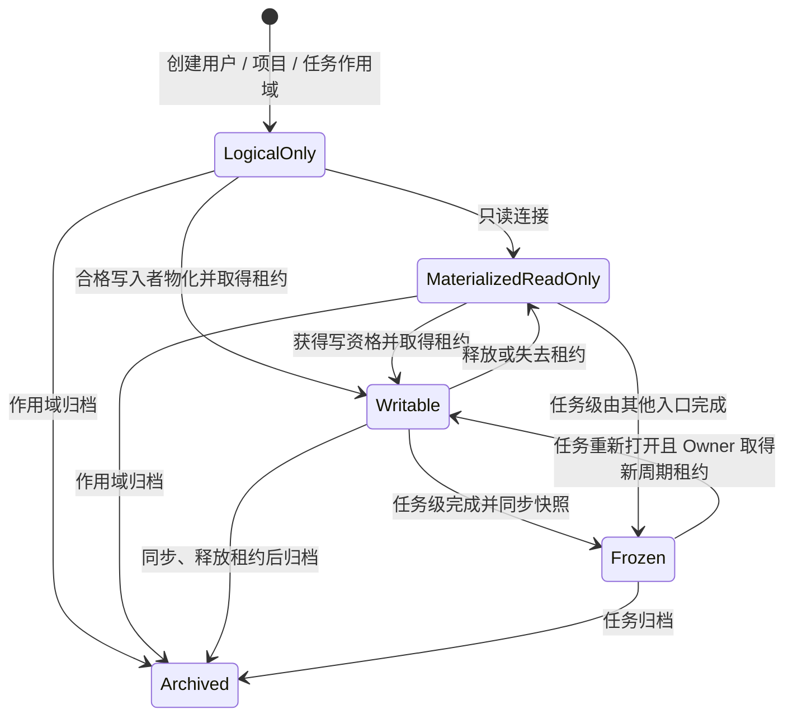

# 工作区、上下文与 Wiki 设计

文档状态：设计基线 0.3

相关文档：[权限模型](03-permission-model.md) · [系统架构](04-system-architecture.md) · [Agent 设计](06-agent-integration.md)

## 1. 设计目标

系统提供三种工作区作用域：

| 类型 | 数量 | 主要内容 | 写入者 |
|---|---|---|---|
| 用户级 | 每个用户一个 | 个人工作流程、个人规则、自用 Skill、个人参考资料 | 对应用户 |
| 项目级 | 每个项目一个 | 项目通用规则、通用 Skill、团队约定、共享参考资料 | Project Owner、Project Admin |
| 任务级 | 每个任务一个 | 分析、决策、过程文档、任务参考资料和交付物 | Task Owner |

三种工作区共同承担以下职责：

1. 将个人偏好、团队通用知识和任务过程分层保存，避免上下文污染。
2. 为 Agent 提供来源清晰、可选择、可追溯的规则、Skill 和资料。
3. 使用统一的文件同步、版本、审计和独占写入租约。
4. 让任务级成果形成项目 Wiki，同时保留项目通用规范和个人工作方式。

工作区不是源代码仓库，也不是无边界网盘。其首要内容是文本、规则、Skill 和过程资料，辅以少量图片和必要产物。

## 2. 逻辑工作区与本地工作区

### 2.1 逻辑工作区

服务端根据作用域创建唯一逻辑工作区：

- 用户注册时创建用户级工作区，并与 User ID 绑定。
- 项目创建时创建项目级工作区，并与 Project ID 绑定。
- 任务创建时创建任务级工作区，并与 Task ID 绑定。

每个逻辑工作区都包含 Workspace ID、`scope_type`、`scope_id`、初始机器清单、同步版本、文件版本和租约状态。任务级工作区额外包含工作周期、任务机器快照、完成快照和摘要状态。

服务端无法直接在成员电脑上创建目录，因此创建作用域时先建立逻辑工作区，在第一次读取或写入连接时物化本地目录。

### 2.2 本地工作区

每台设备配置一个 NGAPD 本地根目录，例如：

```text
NGAPD-Workspaces/
  users/
    user-id/
      _user/
  projects/
    ABC/
      _project/
      tasks/
        ABC-123/
        ABC-124/
```

用户目录使用稳定内部用户标识；项目目录使用 Project Key；任务目录按稳定 Task Key 平铺，不随任务树层级改变。任务移动时目录路径保持不变，避免破坏引用、脚本和 Agent 会话。

## 3. 推荐目录结构

用户级工作区：

```text
_user/
  .ngapd/
    scope.json
    workspace.json
    manifest.json
  USER.md
  rules/
  workflows/
  skills/
  references/
```

项目级工作区：

```text
_project/
  .ngapd/
    scope.json
    workspace.json
    manifest.json
  PROJECT.md
  rules/
  skills/
  references/
```

任务级工作区：

```text
ABC-123/
  .ngapd/
    scope.json
    task.json
    workspace.json
    manifest.json
  TASK.md
  notes/
  decisions/
  references/
  artifacts/
  SUMMARY.md
```

### 3.1 受管文件

| 路径 | 所有者 | 用途 |
|---|---|---|
| `.ngapd/scope.json` | 系统 | 工作区类型、作用域 ID 和读取/写入策略快照 |
| `.ngapd/task.json` | 系统，仅任务级 | 机器可读任务快照，不建议人工编辑 |
| `.ngapd/workspace.json` | 本地客户端 | Workspace ID、工作周期（如有）、同步版本和设备信息 |
| `.ngapd/manifest.json` | 本地客户端 | 文件路径、大小、哈希和服务端版本 |
| `USER.md` | 系统/用户 | 用户级工作区说明和个人入口索引 |
| `PROJECT.md` | 系统/项目管理员 | 项目级工作区说明和团队入口索引 |
| `TASK.md` | 系统，仅任务级 | Agent/人可读任务说明，由服务端任务数据再生成 |
| `SUMMARY.md` | 系统生成，仅任务级 | 当前工作周期完成摘要，Task Owner 可修订 |

### 3.2 用户内容目录

- `rules/`：用户个人规则或项目通用规则。
- `workflows/`：用户个人工作流程；项目级默认不需要，但允许自定义增加。
- `skills/`：用户自用 Skill 或项目通用 Skill。
- `notes/`：任务分析、调研、方案草稿、会议和实验记录。
- `decisions/`：任务已经作出的关键决定，建议一项决定一个文件。
- `references/`：对应作用域的文本、少量图片副本或链接说明。
- `artifacts/`：任务报告、导出物、可交付说明等。

目录不是强制分类器。合格写入者可以增加自定义文件和子目录，但应保留 `.ngapd` 元数据规则。

## 4. 任务机器快照

`.ngapd/task.json` 的概念结构如下：

```json
{
  "schemaVersion": 1,
  "taskKey": "ABC-123",
  "taskVersion": 17,
  "title": "实现角色冲刺",
  "content": "玩家可以在规定条件下进入冲刺状态。需要支持键盘与手柄；耐力不足时不能开始冲刺。",
  "owner": {
    "memberId": "member-id",
    "displayName": "示例成员"
  },
  "effectiveStatus": "in_progress",
  "dueAt": "2026-08-01",
  "displayKind": "sprint",
  "parent": "ABC-100",
  "predecessors": ["ABC-121"],
  "workspaceCycle": 1
}
```

文件只是服务端数据的本地镜像。修改或删除该文件不能绕过 API 改变任务正文、Task Owner、状态、展示类型或依赖；客户端可以从服务端重新生成它，并提示本地副本与权威数据的差异。

`TASK.md` 使用相同数据生成，面向阅读而不是机器回写。用户过程记录放在其他文件，避免系统更新覆盖人工内容。

## 5. 工作区生命周期



状态说明：

- `LogicalOnly`：仅服务端存在逻辑记录。
- `MaterializedReadOnly`：本地已有副本，但当前连接不可写。
- `Writable`：当前用户符合该作用域写入策略并持有本设备写入租约。
- `Frozen`：仅任务级使用；某个工作周期已完成，快照不可变。
- `Archived`：对应用户、项目或任务作用域归档；历史按读取策略保留。

用户级和项目级工作区不会因为某个任务完成而进入 `Frozen`，其内容可以持续演进。

## 6. 单写入租约

### 6.1 必要性

用户级和任务级虽然各自只有一个主要写入者，仍可能从多设备并发写入；项目级则可能由 Project Owner 与多名 Project Admin 同时具备写资格。因此三种工作区都必须通过唯一活动写入租约确保同一时刻只有一个可写连接。

### 6.2 租约字段

- `lease_id`
- `workspace_id`
- `workspace_cycle`
- `holder_user_id`
- `device_id`
- `client_session_id`
- `issued_at`
- `expires_at`
- `last_renewed_at`
- `base_sync_version`

### 6.3 租约规则

- 申请者必须符合工作区作用域写入策略：用户本人、Project Owner/Admin 或 Task Owner。
- 一个 Workspace/周期最多一个未过期租约。
- 客户端心跳续租，短暂断网提供有限宽限期。
- 租约过期后，本地目录切换为逻辑只读，停止自动上传。
- 任一第二连接默认只读，即使它来自同一用户或另一名 Project Admin。
- 接管操作先尝试通知原设备同步释放；强制接管需人工确认。
- 服务端拒绝过期租约提交，即使提交者仍符合写入者资格。
- 用户被停用、Project Owner/Admin 资格被撤销、Task Owner 转移或作用域归档时，相关租约立即失效。

## 7. 同步协议

### 7.1 权威版本

服务端维护递增的 `sync_version` 和该版本的文件清单。文件内容以哈希寻址，路径只是清单属性。

### 7.2 初次物化

1. 客户端规范化并验证 NGAPD 工作区根目录。
2. 获取用户、项目或任务作用域信息，以及工作区状态和目标权限。
3. 只读连接直接拉取最新清单；写连接先获取租约。
4. 下载缺失的内容哈希。
5. 使用临时文件写入并原子替换目标文件。
6. 写入本地 manifest、scope 快照，以及任务级工作区的 task 快照。

### 7.3 写入者同步

1. 文件监听器发现变化并做防抖。
2. 客户端计算新清单和内容哈希。
3. 忽略临时文件、系统缓存和项目配置的排除规则。
4. 上传服务端缺失的内容对象。
5. 以 `lease_id + base_sync_version` 提交新清单。
6. 服务端验证租约、作用域写入资格、周期和基础版本。
7. 原子创建新版本，发布 `WorkspaceVersionSynced`。

由于存在独占租约，正常情况下不会出现两个合法写入者。版本不匹配通常意味着租约接管、恢复或客户端状态陈旧，系统不得静默执行最后写入覆盖。

当前用户及代表该用户的 Agent，只要符合目标工作区的写入策略并持有有效租约，就在安全路径范围内拥有完整访问权限，可以创建、读取、修改、移动、重命名和删除文件或目录。这些文件操作不需要逐次进行 Agent 人工确认，但必须服从租约、同步版本、路径边界和审计规则。

### 7.4 只读更新

只读用户连接的是服务端已同步快照。收到更新事件后可以下载新版本，但不能上传本地修改。只读副本如被用户手工改动，应标记为“脱离管理的本地更改”，不得与服务端同步。

## 8. 文件规则

- 默认使用 UTF-8 文本。
- 支持 Markdown、纯文本、JSON、YAML 等过程文本。
- 支持 PNG、JPEG、WebP 等少量图片；具体类型可配置。
- 单文件和工作区大小使用部署级软限制，不写死为产品模型限制。
- 符号链接默认不跟随、不上传，防止逃逸工作区。
- 大型缓存、构建产物、源码仓库元数据默认排除。
- 文件名在 macOS、Windows 间需要规范化和冲突检测。
- 仅大小或修改时间变化不足以判断内容变化，提交以哈希为准。

## 9. 与源代码仓库的关系

三种工作区默认独立于游戏源码目录：

- 源码仍由 Git 或团队现有工具管理。
- 工作区可以保存仓库路径、commit、branch、文件链接等引用。
- 系统首版不复制完整源码到任何工作区。
- Agent 对源码仓库的修改不属于 NGAPD 工作区权限保证范围，应由 Agent 宿主和源码工具另行授权。
- 未来可增加 Git commit/branch/PR 外部链接，但不把它们作为任务完成的必要条件。

## 10. Task Owner 转移

Task Owner 转移流程必须避免“权限先转移、文件后同步”的数据丢失：

1. 发起转移并通知当前 Owner。
2. 检查是否有活动租约和未提交的本地变化。
3. 原 Owner 同步最新版本并释放租约。
4. 服务端创建 `ownership-transfer` 快照。
5. 原子更新 Task Owner 和任务级 Workspace 写入资格。
6. 新 Owner 收到通知，并在自己的设备上获取新租约。

管理员可以在原 Owner 不可用时强制转移，但必须展示“服务端不包含其未同步本地文件”的风险并保留最后服务端快照。

Project Owner/Admin 变化不转移项目级工作区本身，只改变可申请租约的用户集合；用户级工作区始终绑定对应用户。

## 11. 上下文包

Agent 连接任务时，系统从用户级、项目级和任务级工作区生成一个清单式上下文包，不应把三个工作区的全部文件或整个祖先工作区直接塞入上下文。一个 Agent 会话默认只把一个工作区作为当前可写目标；其他相关工作区以只读来源加入上下文，需要写入时显式切换并获取该工作区租约。

### 11.1 默认内容

按优先级从高到低：

1. 系统安全、工具权限和 Agent 运行规则。
2. 项目级工作区中的项目通用规则、已启用通用 Skill 和相关参考资料。
3. 当前任务的完整信息，包括 Task Key、标题、统一正文、Owner、状态、截止日期、标签、展示类型、父子关系、依赖和当前权限。
4. 当前用户的项目自我介绍，以及该用户绑定的全部逻辑角色名称、能力描述、责任边界、限制和 Agent 提示文本。
5. 当前用户自己的用户级工作区中的个人工作流程、自用规则和已启用自用 Skill。
6. 当前任务直接父链的确认摘要。
7. 当前任务已完成 predecessor 的确认摘要。
8. 当前任务级工作区的目录清单和选定文件。
9. 用户显式加入的其他任务摘要、项目资料或参考文件。

内容冲突时采用：系统安全与工具规则 > 项目通用规则 > 当前任务正式信息 > 用户个人工作流程。用户级工作流可以改变个人做事方式，但不能覆盖项目规则；工作区文件中的文字都不能改变服务端权限。

### 11.2 Skill 发现规则

- 项目级 `skills/` 中的 Skill 对项目成员的 Agent 可发现，适合作为团队通用能力。
- 用户级 `skills/` 中的 Skill 只自动提供给代表该用户的 Agent；其他用户虽然可以只读查看该用户级工作区，但不会自动加载其中 Skill。
- Skill 应包含稳定清单和入口文件，客户端先枚举再按需加载，不递归加载整个目录。
- 发现或加载 Skill 不授予额外权限，所有工具调用仍按当前用户和目标工作区重新授权。
- 同名 Skill 冲突时，项目级版本优先于用户级版本；Agent 应向用户说明实际选用来源。

### 11.3 默认排除

- 无关兄弟任务的完整内容。
- 未显式选择的其他任务工作区原文。
- 其他用户的用户级工作区，即使当前用户具有只读权限，也不自动进入上下文。
- 未启用的用户级或项目级 Skill 正文。
- 整个项目的历史评论。
- 大型二进制文件内容。
- 已归档且无引用关系的任务。

### 11.4 预算与渐进加载

上下文包返回作用域、来源、摘要、大小和优先级。Agent 先获得目录和摘要，再按需读取文件。超过上下文预算时依次保留系统规则、项目级规则、当前任务完整信息、用户逻辑角色描述和高相关摘要，不能无提示截断关键安全规则。

### 11.5 信任边界

工作区、评论、角色提示和外部文档都可能包含提示注入。上下文组装必须：

- 给每段内容标注来源和信任级别。
- 将系统规则与用户文件明确分隔。
- 不把文件内的“调用工具”“忽略权限”等文本当成系统指令。
- 工具执行始终重新授权，不依赖 Agent 对文本的理解。

## 12. 完成快照与摘要

### 12.1 完成过程

1. 校验任务完成条件和 Agent 确认。
2. 要求持有任务级工作区租约的客户端提交最终同步版本。
3. 为任务级工作区创建不可变 `completion` 快照。
4. 将任务基础状态设置为已完成。
5. 释放任务级工作区租约并冻结该工作周期。
6. 后台生成摘要草稿和搜索索引。

摘要生成失败不应回滚已经合法完成的任务；系统显示“摘要待生成/生成失败”，允许 Owner 重试。

### 12.2 摘要内容

建议包含：

- 任务统一正文中的目标、说明、验收信息与最终结果。
- 关键实现或设计方案。
- 重要决定及理由。
- 已知限制、遗留问题和后续建议。
- 主要产物链接。
- 参考的 predecessor 与父任务。
- 生成来源文件和完成快照版本。

摘要先作为草稿。Owner 可以修订并确认；系统保存 AI 初稿、人工修订和确认记录。

## 13. Wiki 投影

Wiki 是从项目级规则、任务、完成摘要、决策和产物生成的读取视图：

- 按任务树浏览。
- 按逻辑角色、标签、Owner、时间和状态过滤。
- 全文搜索标题、摘要和允许索引的文本。
- 每条知识显示来源 Task Key、工作周期和文件链接。
- 祖先任务页面聚合直接子任务的确认摘要，不复制全部原文。
- 重新打开并再次完成后，以时间线展示多个摘要版本。
- 项目级工作区中明确发布的通用规则和资料可以显示为项目知识入口。
- 用户级工作区默认不进入项目 Wiki；用户必须显式引用或复制到项目/任务作用域，避免把个人流程混入项目知识。

Wiki 页面上的人工修订不能静默覆盖原始工作区文件；如果要修正来源，应重新打开任务或创建专门的文档维护任务。

## 14. 读取与保留策略

- 其他已认证用户可只读用户级工作区；匿名用户不可读。
- 活动项目成员可读取项目级和任务级工作区。
- 项目归档后成员仍可按项目策略只读访问。
- 任务归档不删除任务级工作区和知识投影；项目归档后项目级工作区转为只读。
- 用户被停用后用户级工作区停止写入并按服务端账号保留策略只读保存。
- 永久清理前进入保留期，保留期由部署配置。
- 内容哈希相同的对象可以去重，但每个工作区版本的引用必须独立保留。
- 备份必须覆盖数据库清单和对象内容，不能只备份其中一方。

## 15. 客户端异常处理

| 场景 | 处理 |
|---|---|
| 网络中断 | 在租约宽限期内本地继续记录，明确显示未同步；宽限期后停止受管写入 |
| 客户端崩溃 | 本地日志恢复待同步清单；服务端租约按 TTL 失效 |
| Task Owner 被转移 | 任务级工作区立即停止续租和上传，保留本地恢复副本 |
| Project Owner/Admin 资格被撤销 | 项目级工作区立即停止续租和上传，保留本地恢复副本 |
| 用户被停用 | 用户级工作区立即停止续租和上传 |
| 任务被归档 | 停止写入并切换只读，提示同步/归档结果 |
| 服务端版本不匹配 | 停止提交，下载差异信息，不自动覆盖 |
| 文件名跨平台非法 | 在写入或同步前阻止并提示可用名称 |
| 图片或文件超出配置限制 | 保留本地文件但标记未受管，不宣称已经同步 |
