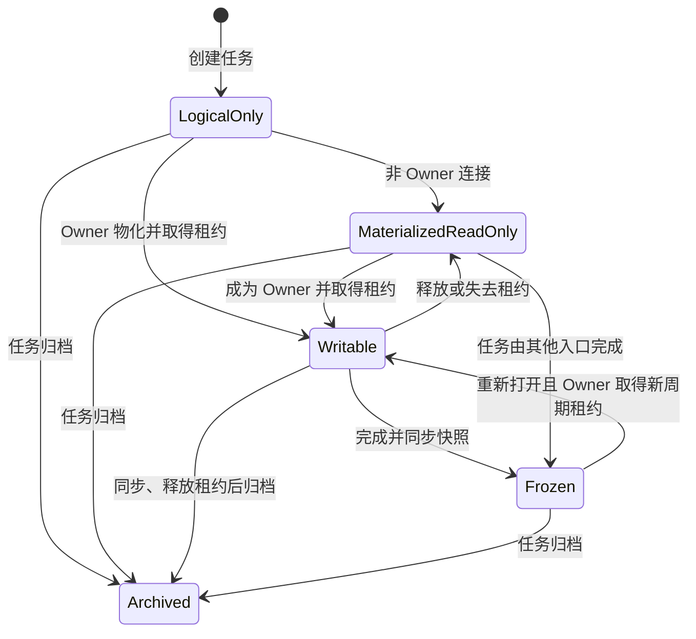

# 工作区、上下文与 Wiki 设计

文档状态：设计基线 0.1  
相关文档：[权限模型](03-permission-model.md) · [系统架构](04-system-architecture.md) · [Agent 设计](06-agent-integration.md)

## 1. 设计目标

任务工作区承担三个职责：

1. 保存 Agent 协作过程中的分析、决策、参考资料和交付物。
2. 为当前任务提供稳定、有限、可解释的上下文边界。
3. 在任务完成后形成可追溯、可检索的项目知识。

工作区不是源代码仓库，也不是无边界的项目共享盘。其首要内容是任务过程文本，辅以少量图片和必要产物。

## 2. 逻辑工作区与本地工作区

### 2.1 逻辑工作区

任务创建时，服务端立即创建逻辑工作区，包括：

- Workspace ID 与 Task ID 绑定。
- 工作周期编号。
- 初始机器清单。
- 系统生成的任务说明。
- 当前同步版本。
- 文件、快照和摘要状态。

服务端无法直接在成员电脑上创建目录，因此“创建任务时创建文件夹”在分布式系统中的准确实现是：创建逻辑工作区，在首次连接时物化本地目录。

### 2.2 本地工作区

每台设备为项目配置一个本地根目录，例如：

```text
NGAPD-Workspaces/
  ABC/
    ABC-123/
    ABC-124/
```

任务目录按稳定 Task Key 平铺，不随任务树层级改变。任务移动时目录路径保持不变，避免破坏引用、脚本和 Agent 会话。

## 3. 推荐目录结构

```text
ABC-123/
  .ngapd/
    task.json
    workspace.json
    manifest.json
  TASK.md
  notes/
  decisions/
  references/
  artifacts/
  SUMMARY.md
```

### 3.1 受管文件

| 路径 | 所有者 | 用途 |
|---|---|---|
| `.ngapd/task.json` | 系统 | 机器可读任务快照，不建议人工编辑 |
| `.ngapd/workspace.json` | 本地客户端 | Workspace ID、工作周期、同步版本和设备信息 |
| `.ngapd/manifest.json` | 本地客户端 | 文件路径、大小、哈希和服务端版本 |
| `TASK.md` | 系统 | Agent/人可读任务说明，由服务端任务数据再生成 |
| `SUMMARY.md` | 系统生成、Owner 可修订 | 当前工作周期完成摘要 |

### 3.2 用户内容目录

- `notes/`：分析、调研、方案草稿、会议和实验记录。
- `decisions/`：已经作出的关键决定，建议一项决定一个文件。
- `references/`：与当前任务直接有关的文本和少量图片副本或链接说明。
- `artifacts/`：报告、导出物、可交付说明等。

目录不是强制分类器。系统允许 Owner 增加自定义文件和子目录，但保留目录名和 `.ngapd` 规则。

## 4. 任务机器快照

`.ngapd/task.json` 的概念结构如下：

```json
{
  "schemaVersion": 1,
  "taskKey": "ABC-123",
  "taskVersion": 17,
  "title": "实现角色冲刺",
  "goal": "玩家可以在规定条件下进入冲刺状态",
  "acceptanceCriteria": [
    "键盘与手柄都可触发",
    "耐力不足时不能开始冲刺"
  ],
  "owner": {
    "memberId": "member-id",
    "displayName": "示例成员"
  },
  "effectiveStatus": "in_progress",
  "dueAt": "2026-08-01",
  "parent": "ABC-100",
  "predecessors": ["ABC-121"],
  "workspaceCycle": 1
}
```

文件只是服务端数据的本地镜像。修改该文件不能绕过 API 改变 Task Owner、状态或依赖；客户端发现人工修改时应覆盖恢复或提示差异。

`TASK.md` 使用相同数据生成，面向阅读而不是机器回写。用户过程记录放在其他文件，避免系统更新覆盖人工内容。

## 5. 工作区生命周期



状态说明：

- `LogicalOnly`：仅服务端存在逻辑记录。
- `MaterializedReadOnly`：本地已有副本，但当前连接不可写。
- `Writable`：Task Owner 持有本设备写入租约。
- `Frozen`：某个工作周期已完成，快照不可变。
- `Archived`：任务归档；历史仍可读。

## 6. 单写入租约

### 6.1 必要性

每个任务只有一个 Owner 可以消除跨成员冲突，但同一个 Owner 仍可能从两台设备、两个客户端或多个 Agent 会话同时写入。因此服务端必须把“唯一 Owner”落实为“唯一活动写入租约”。

### 6.2 租约字段

- `lease_id`
- `workspace_id`
- `workspace_cycle`
- `owner_user_id`
- `device_id`
- `client_session_id`
- `issued_at`
- `expires_at`
- `last_renewed_at`
- `base_sync_version`

### 6.3 租约规则

- 只有当前 Task Owner 可以申请。
- 一个 Workspace/周期最多一个未过期租约。
- 客户端心跳续租，短暂断网提供有限宽限期。
- 租约过期后，本地目录切换为逻辑只读，停止自动上传。
- 同一 Owner 的第二设备默认只读。
- 接管操作先尝试通知原设备同步释放；强制接管需人工确认。
- 服务端拒绝过期租约提交，即使提交者仍是 Task Owner。

## 7. 同步协议

### 7.1 权威版本

服务端维护递增的 `sync_version` 和该版本的文件清单。文件内容以哈希寻址，路径只是清单属性。

### 7.2 初次物化

1. 客户端规范化并验证项目根目录。
2. 获取任务、工作区状态和目标权限。
3. 只读连接直接拉取最新清单；写连接先获取租约。
4. 下载缺失的内容哈希。
5. 使用临时文件写入并原子替换目标文件。
6. 写入本地 manifest 和任务快照。

### 7.3 Owner 同步

1. 文件监听器发现变化并做防抖。
2. 客户端计算新清单和内容哈希。
3. 忽略临时文件、系统缓存和项目配置的排除规则。
4. 上传服务端缺失的内容对象。
5. 以 `lease_id + base_sync_version` 提交新清单。
6. 服务端验证租约、Owner、周期和基础版本。
7. 原子创建新版本，发布 `WorkspaceVersionSynced`。

由于存在独占租约，正常情况下不会出现两个合法写入者。版本不匹配通常意味着租约接管、恢复或客户端状态陈旧，系统不得静默执行最后写入覆盖。

### 7.4 只读更新

其他成员连接的是服务端已同步快照。收到更新事件后可以下载新版本，但不能上传本地修改。只读副本如被用户手工改动，应标记为“脱离管理的本地更改”，不得与服务端同步。

## 8. 文件规则

- 默认使用 UTF-8 文本。
- 支持 Markdown、纯文本、JSON、YAML 等过程文本。
- 支持 PNG、JPEG、WebP 等少量图片；具体类型可配置。
- 单文件和工作区大小使用部署级软限制，不写死为产品模型限制。
- 符号链接默认不跟随、不上传，防止逃逸工作区。
- 大型缓存、构建产物、源码仓库元数据默认排除。
- 文件名在 macOS、Windows 间需要规范化和冲突检测。
- 仅大小或修改时间变化不足以判断内容变化，提交以哈希为准。

## 9. 与源代码仓库的关系

任务工作区默认独立于游戏源码目录：

- 源码仍由 Git 或团队现有工具管理。
- 工作区可以保存仓库路径、commit、branch、文件链接等引用。
- 系统首版不复制完整源码到任务工作区。
- Agent 对源码仓库的修改不属于 NGAPD 工作区权限保证范围，应由 Agent 宿主和源码工具另行授权。
- 未来可增加 Git commit/branch/PR 外部链接，但不把它们作为任务完成的必要条件。

## 10. Owner 转移

Owner 转移流程必须避免“权限先转移、文件后同步”的数据丢失：

1. 发起转移并通知当前 Owner。
2. 检查是否有活动租约和未提交的本地变化。
3. 原 Owner 同步最新版本并释放租约。
4. 服务端创建 `ownership-transfer` 快照。
5. 原子更新 Task Owner 和 Workspace 写入资格。
6. 新 Owner 收到通知，并在自己的设备上获取新租约。

管理员可以在原 Owner 不可用时强制转移，但必须展示“服务端不包含其未同步本地文件”的风险并保留最后服务端快照。

## 11. 上下文包

Agent 连接任务时，系统生成一个清单式上下文包，不应把整个项目或整个祖先工作区直接塞入上下文。

### 11.1 默认内容

按优先级从高到低：

1. 系统安全与工具规则。
2. 项目级规范和当前 Agent Skill。
3. 当前用户的项目自我介绍和逻辑角色描述。
4. 当前任务内容、状态、验收条件、截止日期和权限。
5. 当前任务直接父链的确认摘要。
6. 当前任务已完成 predecessor 的确认摘要。
7. 当前工作区的目录清单和选定文件。
8. 用户显式加入的其他任务摘要或参考资料。

### 11.2 默认排除

- 无关兄弟任务的完整内容。
- 未显式选择的其他任务工作区原文。
- 整个项目的历史评论。
- 大型二进制文件内容。
- 已归档且无引用关系的任务。

### 11.3 预算与渐进加载

上下文包返回来源、摘要、大小和优先级。Agent 先获得目录和摘要，再按需读取文件。超过上下文预算时依次保留当前任务、验收条件、项目规范和高相关摘要，不能无提示截断关键安全规则。

### 11.4 信任边界

工作区、评论、角色提示和外部文档都可能包含提示注入。上下文组装必须：

- 给每段内容标注来源和信任级别。
- 将系统规则与用户文件明确分隔。
- 不把文件内的“调用工具”“忽略权限”等文本当成系统指令。
- 工具执行始终重新授权，不依赖 Agent 对文本的理解。

## 12. 完成快照与摘要

### 12.1 完成过程

1. 校验任务完成条件和 Agent 确认。
2. 要求持有租约的客户端提交最终同步版本。
3. 创建不可变 `completion` 快照。
4. 将任务基础状态设置为已完成。
5. 释放租约并冻结该工作周期。
6. 后台生成摘要草稿和搜索索引。

摘要生成失败不应回滚已经合法完成的任务；系统显示“摘要待生成/生成失败”，允许 Owner 重试。

### 12.2 摘要内容

建议包含：

- 任务目标与最终结果。
- 关键实现或设计方案。
- 重要决定及理由。
- 已知限制、遗留问题和后续建议。
- 主要产物链接。
- 参考的 predecessor 与父任务。
- 生成来源文件和完成快照版本。

摘要先作为草稿。Owner 可以修订并确认；系统保存 AI 初稿、人工修订和确认记录。

## 13. Wiki 投影

Wiki 是从任务、完成摘要、决策和产物生成的读取视图：

- 按任务树浏览。
- 按逻辑角色、标签、Owner、时间和状态过滤。
- 全文搜索标题、摘要和允许索引的文本。
- 每条知识显示来源 Task Key、工作周期和文件链接。
- 祖先任务页面聚合直接子任务的确认摘要，不复制全部原文。
- 重新打开并再次完成后，以时间线展示多个摘要版本。

Wiki 页面上的人工修订不能静默覆盖原始工作区文件；如果要修正来源，应重新打开任务或创建专门的文档维护任务。

## 14. 读取与保留策略

- 活动项目成员可读取项目内已同步工作区。
- 项目归档后成员仍可按项目策略只读访问。
- 任务归档不删除工作区和知识投影。
- 永久清理前进入保留期，保留期由部署配置。
- 内容哈希相同的对象可以去重，但每个工作区版本的引用必须独立保留。
- 备份必须覆盖数据库清单和对象内容，不能只备份其中一方。

## 15. 客户端异常处理

| 场景 | 处理 |
|---|---|
| 网络中断 | 在租约宽限期内本地继续记录，明确显示未同步；宽限期后停止受管写入 |
| 客户端崩溃 | 本地日志恢复待同步清单；服务端租约按 TTL 失效 |
| Owner 被转移 | 立即停止续租和上传，保留本地恢复副本 |
| 任务被归档 | 停止写入并切换只读，提示同步/归档结果 |
| 服务端版本不匹配 | 停止提交，下载差异信息，不自动覆盖 |
| 文件名跨平台非法 | 在写入或同步前阻止并提示可用名称 |
| 图片或文件超出配置限制 | 保留本地文件但标记未受管，不宣称已经同步 |

